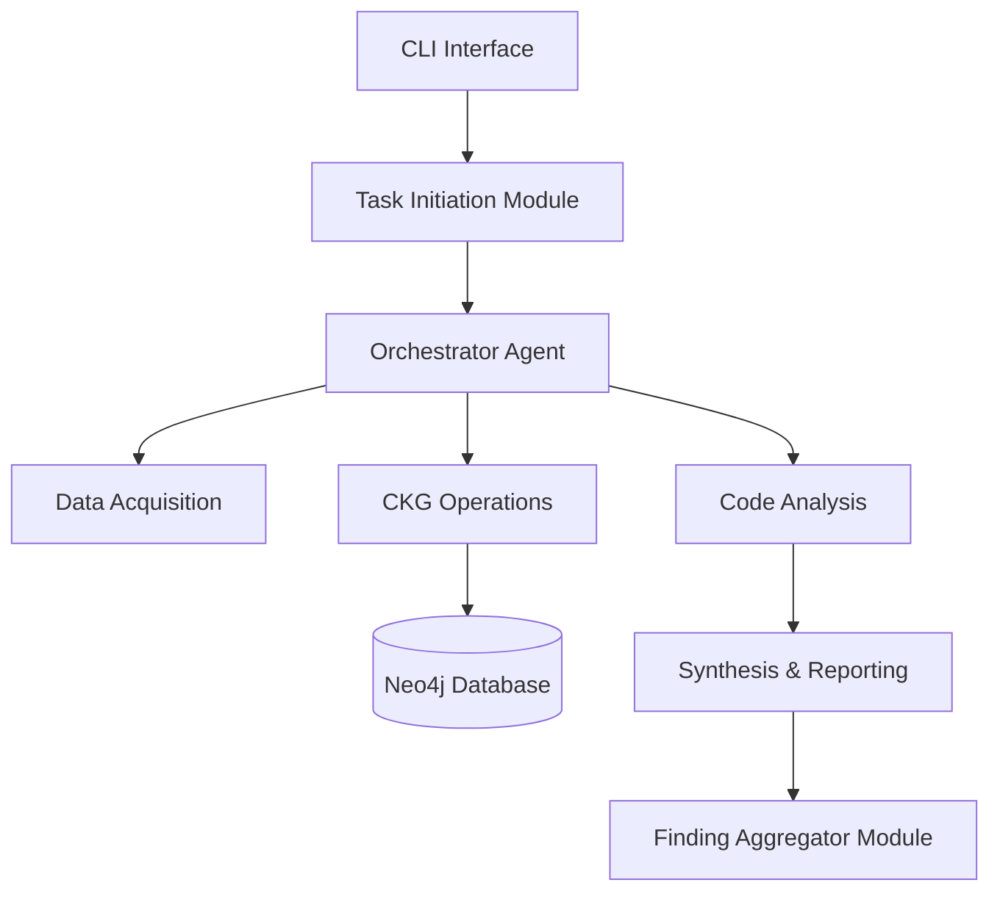

# 🚀 RepoChat Phase 4 - Setup & Manual Testing Guide

**Version:** v1.0  
**Date:** 2025-06-06  
**Status:** Phase 4 Development - 4/9 Tasks Completed  

## 📋 Tổng quan

Hướng dẫn này cung cấp chi tiết về:
- ✅ Setup môi trường development với Docker Compose
- ✅ Cấu hình OpenAI API key và biến môi trường  
- ✅ Manual testing các tính năng Phase 4 đã implement
- ✅ Troubleshooting và debugging common issues

## 🏗️ Kiến trúc Phase 4



## 🛠️ Requirements

### System Requirements
- **OS**: Linux, macOS, Windows (với WSL2)
- **RAM**: Minimum 8GB (Recommended 16GB+)
- **Storage**: 5GB free space
- **Network**: Internet connection cho Docker images và OpenAI API

### Software Requirements
- **Docker**: v20.10+ 
- **Docker Compose**: v2.0+
- **Git**: v2.20+
- **OpenAI API Key**: Valid API key với available credits

## 🚀 Quick Start

### 1. Clone Repository

```bash
# Clone project
git clone <repository_url>
cd repochat

# Verify project structure
ls -la
# Should see: backend/, docs/, docker-compose.yml, env.example, etc.
```

### 2. Environment Setup

```bash
# Copy environment template
cp env.example .env

# Edit .env file để thêm OpenAI API key
nano .env
# hoặc sử dụng editor yêu thích
```

### 3. Configure Environment Variables

Cập nhật file `.env` với thông tin sau:

```bash
# RepoChat Environment Configuration

# 🔑 OpenAI Configuration (REQUIRED)
OPENAI_API_KEY=sk-your-actual-openai-api-key-here

# 🗄️ Neo4j Database Configuration
NEO4J_URI=bolt://localhost:7687
NEO4J_USERNAME=neo4j
NEO4J_PASSWORD=repochat123

# 🔧 Application Configuration
ENVIRONMENT=development
LOG_LEVEL=DEBUG
PYTHONPATH=./backend/src

# 🐳 Docker Development
COMPOSE_PROJECT_NAME=repochat

# 🌐 Ports Configuration
DEBUG_PORT=5678
BACKEND_PORT=8000
FRONTEND_PORT=3000
NEO4J_BROWSER_PORT=7474
NEO4J_BOLT_PORT=7687
```

### 4. Start Services

```bash
# Start core services (backend + Neo4j)
docker-compose up -d

# Verify services are running
docker-compose ps

# Check logs
docker-compose logs -f backend
```

### 5. Verify Installation

```bash
# Check Neo4j browser (mở trong web browser)
# URL: http://localhost:7474
# Login: neo4j / repochat123

# Test backend container
docker-compose exec backend python -c "print('Backend container working!')"

# Test CLI interface
docker-compose exec backend python repochat_cli.py --help
```

## 📊 Phase 4 Features Status

| Task ID | Feature | Status | Testing |
|---------|---------|--------|---------|
| 4.1 | CLI Interface với scan-project | ✅ **COMPLETED** | ✅ Available |
| 4.2 | CLI extension với review-pr | ✅ **COMPLETED** | ✅ Available |
| 4.3 | TaskInitiationModule | ✅ **COMPLETED** | ✅ Available |
| 4.4 | FindingAggregatorModule | ✅ **COMPLETED** | ✅ Available |
| 4.5 | ReportGeneratorModule | 🚧 **IN PROGRESS** | ⚪ Not Ready |
| 4.6 | PR Impact Integration | 🚧 **IN PROGRESS** | ⚪ Not Ready |
| 4.7 | OutputFormatterModule | 🚧 **IN PROGRESS** | ⚪ Not Ready |
| 4.8 | PresentationModule | 🚧 **IN PROGRESS** | ⚪ Not Ready |
| 4.9 | Q&A Functionality | 🚧 **IN PROGRESS** | ⚪ Not Ready |

## 🧪 Manual Testing Guide

### Test 1: System Status Check

```bash
# Test command
docker-compose exec backend python repochat_cli.py status

# Expected output
🟢 RepoChat System Status
========================
✅ Orchestrator Agent: Initialized
✅ Data Acquisition: Ready  
✅ CKG Operations: Ready
✅ Code Analysis: Ready
✅ LLM Services: Ready
✅ Synthesis & Reporting: Ready
⏱️  System Uptime: X.XXs
📊 Memory Usage: XX.X MB
```

### Test 2: Help Documentation

```bash
# Test main help
docker-compose exec backend python repochat_cli.py --help

# Expected output
Usage: repochat_cli.py [OPTIONS] COMMAND [ARGS]...

  🤖 RepoChat v1.0 - AI Code Review Assistant
  
  Trợ lý AI thông minh cho việc review code và phân tích kiến trúc.

Options:
  -v, --verbose       Hiển thị thông tin chi tiết
  --version          Hiển thị phiên bản
  --help             Show this message and exit.

Commands:
  review-pr      📝 Review Pull Request
  scan-project   🔍 Quét và phân tích repository
  status         📊 Hiển thị trạng thái hệ thống
```

### Test 3: Scan Project Functionality (Task 4.1)

```bash
# Test with public repository
docker-compose exec backend python repochat_cli.py scan-project https://github.com/spring-projects/spring-petclinic.git

# Expected output
🚀 Bắt đầu quét dự án...
✅ Quét dự án hoàn thành thành công!
⏱️  Thời gian thực hiện: X.XXs

# Test with verbose flag
docker-compose exec backend python repochat_cli.py scan-project https://github.com/spring-projects/spring-petclinic.git -v

# Expected verbose output
📋 Task Definition được tạo: task-xxxxx
   Repository: https://github.com/spring-projects/spring-petclinic.git
   Task Type: SCAN_PROJECT
🚀 Bắt đầu quét dự án...
✅ Quét dự án hoàn thành thành công!
⏱️  Thời gian thực hiện: X.XXs
📊 Trạng thái task: completed
📁 Repository đã clone: /app/temp/xxxxx
🔤 Ngôn ngữ phát hiện: ['java', 'html', 'css']
```

### Test 4: Review PR Functionality (Task 4.2)

```bash
# Test PR review command
docker-compose exec backend python repochat_cli.py review-pr https://github.com/spring-projects/spring-petclinic.git 123

# Expected output
🔍 Bắt đầu review Pull Request #123...
✅ Review Pull Request hoàn thành thành công!
⏱️  Thời gian thực hiện: X.XXs
🔗 Pull Request: #123
📄 Thông tin Pull Request:
   PR ID: 123
🔬 Phân tích cơ bản đã hoàn thành. Các tính năng nâng cao sẽ có trong các phase tiếp theo:
   • Phân tích diff PR
   • Tác động đến các phụ thuộc
   • Đề xuất review tự động

# Test with verbose flag
docker-compose exec backend python repochat_cli.py review-pr https://github.com/spring-projects/spring-petclinic.git 123 -v

# Expected verbose output (additional info)
📋 PR Review Task Definition được tạo: task-xxxxx
   Repository: https://github.com/spring-projects/spring-petclinic.git
   Task Type: REVIEW_PR
   PR ID: 123
   PR URL: https://github.com/spring-projects/spring-petclinic.git/pull/123
   PR Identifier: 123
[... previous output ...]
📁 Repository đã clone: /app/temp/xxxxx
🔤 Ngôn ngữ phát hiện: ['java', 'html', 'css']
📊 Số ngôn ngữ: 3
🎯 Ngôn ngữ chính: java
```

### Test 5: TaskInitiationModule (Task 4.3)

Tính năng này được test gián tiếp thông qua Tests 3 & 4 ở trên. Module này chuyển đổi CLI input thành TaskDefinition objects.

**Verification Points:**
- ✅ TaskDefinition được tạo với đúng task_type
- ✅ Repository URL được parse và validate correctly
- ✅ PR ID được extract và stored properly
- ✅ Task ID generation works

### Test 6: FindingAggregatorModule (Task 4.4)

```bash
# Run comprehensive test for FindingAggregatorModule
docker-compose exec backend python -m pytest tests/test_task_4_4_finding_aggregator.py -v

# Expected output
tests/test_task_4_4_finding_aggregator.py::TestFindingAggregatorModule::test_basic_aggregation PASSED
tests/test_task_4_4_finding_aggregator.py::TestFindingAggregatorModule::test_deduplication PASSED  
tests/test_task_4_4_finding_aggregator.py::TestFindingAggregatorModule::test_sorting PASSED
tests/test_task_4_4_finding_aggregator.py::TestFindingAggregatorModule::test_empty_findings PASSED
tests/test_task_4_4_finding_aggregator.py::TestFindingAggregatorModule::test_severity_filtering PASSED
tests/test_task_4_4_finding_aggregator.py::TestFindingAggregatorModule::test_grouping_by_type PASSED
tests/test_task_4_4_finding_aggregator.py::TestFindingAggregatorModule::test_similarity_calculation PASSED
tests/test_task_4_4_finding_aggregator.py::TestFindingAggregatorModule::test_summary_generation PASSED
tests/test_task_4_4_finding_aggregator.py::TestFindingAggregatorModule::test_module_statistics PASSED
tests/test_task_4_4_finding_aggregator.py::TestFindingAggregatorModule::test_error_handling PASSED
tests/test_task_4_4_finding_aggregator.py::TestFindingAggregatorModule::test_configuration_options PASSED
tests/test_task_4_4_finding_aggregator.py::TestFindingAggregatorModule::test_end_to_end_workflow PASSED

================== 17 tests passed ==================
```

## 🧪 Integration Testing

### Test 7: Full Phase 1-3 Integration

```bash
# Run Phase 3 completion test để verify foundation
docker-compose exec backend python tests/phase_3_specific/phase_3_completion_test.py

# Expected output
🚀 Starting Phase 3 Completion Verification
============================================================
🧪 Testing Task 3.1...
✅ Task 3.1: ArchitecturalAnalyzerModule - VERIFIED
🧪 Testing Task 3.2...  
✅ Task 3.2: Unused Elements Detection - VERIFIED
🧪 Testing Task 3.3...
✅ Task 3.3: LLMProviderAbstractionLayer - VERIFIED
🧪 Testing Task 3.4...
✅ Task 3.4: LLMGatewayModule & PromptFormatterModule - VERIFIED
🧪 Testing Task 3.5...
✅ Task 3.5: LLMAnalysisSupportModule - VERIFIED
🧪 Testing Task 3.6...
✅ Task 3.6: Orchestrator LLM Routing - VERIFIED
🧪 Testing Task 3.7...
✅ Task 3.7: PR Impact Analysis - VERIFIED
🧪 Testing Task 3.8...
✅ Task 3.8: StaticAnalysisIntegratorModule Placeholder - VERIFIED

============================================================
📊 PHASE 3 COMPLETION TEST SUMMARY
============================================================
✅ Passed: 8/8 tasks
❌ Failed: 0/8 tasks
📈 Success Rate: 100.0%

🎉 PHASE 3 FULLY COMPLETED!
✅ All 8 tasks implemented and working
🚀 Ready for Phase 4 development
```

### Test 8: End-to-End Repository Analysis

```bash
# Test complete workflow với real project
docker-compose exec backend python repochat_cli.py scan-project https://github.com/ReactiveX/RxJava.git -v

# Monitor logs trong real-time
docker-compose logs -f backend | grep -E "(INFO|ERROR|WARNING)"

# Check Neo4j database content
# Mở browser: http://localhost:7474
# Login: neo4j / repochat123
# Run query: MATCH (n) RETURN count(n) as total_nodes
```

## 📈 Performance Benchmarks

### Expected Performance Metrics

| Operation | Small Project (<100 files) | Medium Project (100-500 files) | Large Project (500+ files) |
|-----------|----------------------------|--------------------------------|----------------------------|
| **Repository Clone** | <2s | <5s | <10s |
| **Language Detection** | <0.5s | <1s | <2s |
| **CKG Construction** | <3s | <15s | <60s |
| **Code Analysis** | <1s | <5s | <15s |
| **Total CLI Execution** | <10s | <30s | <90s |

### Memory Usage

| Component | Expected RAM Usage |
|-----------|-------------------|
| **Neo4j Database** | 512MB - 2GB |
| **Backend Python** | 200MB - 1GB |
| **Docker Overhead** | 100MB - 300MB |
| **Total System** | ~1GB - 4GB |

## 🐛 Troubleshooting

### Common Issues

#### 1. OpenAI API Key Issues

**Problem:** `OpenAI API key is required but not provided`

**Solution:**
```bash
# Check .env file exists và contains valid key
cat .env | grep OPENAI_API_KEY

# Verify key format (starts with sk-)
echo $OPENAI_API_KEY

# Restart containers to pick up new environment
docker-compose down && docker-compose up -d
```

#### 2. Neo4j Connection Issues

**Problem:** `Neo4j service unavailable: Couldn't connect to localhost:7687`

**Solution:**
```bash
# Check Neo4j container status
docker-compose ps neo4j

# Check Neo4j logs
docker-compose logs neo4j

# Restart Neo4j
docker-compose restart neo4j

# Wait for health check
docker-compose exec neo4j cypher-shell -u neo4j -p repochat123 'RETURN 1'
```

#### 3. Module Import Errors

**Problem:** `ModuleNotFoundError: No module named 'shared'`

**Solution:**
```bash
# Ensure PYTHONPATH is set correctly
docker-compose exec backend echo $PYTHONPATH
# Should output: /app/src

# Check if running from correct directory
docker-compose exec backend pwd
# Should output: /app

# Run commands with correct path
docker-compose exec backend bash -c "cd /app && PYTHONPATH=/app/src python repochat_cli.py --help"
```

#### 4. Docker Memory Issues

**Problem:** Container running out of memory

**Solution:**
```bash
# Check Docker memory allocation
docker stats

# Increase Docker memory limit (Docker Desktop)
# Settings > Resources > Memory > 8GB+

# Clean up Docker resources
docker system prune -a

# Restart containers
docker-compose down && docker-compose up -d
```

#### 5. Port Conflicts

**Problem:** `Port already in use`

**Solution:**
```bash
# Check what's using the ports
sudo netstat -tlnp | grep -E ':(7474|7687|8000)'

# Kill conflicting processes
sudo kill -9 <PID>

# Or change ports in docker-compose.yml
# Edit ports section: "7475:7474" instead of "7474:7474"
```

### Debug Mode

```bash
# Run CLI in debug mode với verbose logging
docker-compose exec backend bash -c "LOG_LEVEL=DEBUG python repochat_cli.py scan-project https://github.com/spring-projects/spring-petclinic.git -v"

# Monitor all logs
docker-compose logs -f

# Check specific component logs
docker-compose logs backend | grep "orchestrator"
docker-compose logs backend | grep "data_acquisition"
docker-compose logs backend | grep "ckg_operations"
```

### Log Analysis

```bash
# Check application logs
docker-compose exec backend ls -la logs/
docker-compose exec backend tail -f logs/repochat.log

# Check container logs
docker-compose logs --timestamps backend

# Export logs for analysis
docker-compose logs backend > repochat_debug.log
```

## 📊 Monitoring & Metrics

### Key Metrics to Monitor

1. **Execution Time**: CLI command completion time
2. **Memory Usage**: Container và host memory consumption  
3. **Database Growth**: Neo4j node và relationship count
4. **API Usage**: OpenAI API calls và costs
5. **Error Rates**: Failed operations percentage

### Performance Monitoring

```bash
# Monitor resource usage
docker stats repochat-backend repochat-neo4j

# Check database metrics
docker-compose exec neo4j cypher-shell -u neo4j -p repochat123 "
MATCH (n) RETURN labels(n)[0] as NodeType, count(n) as Count
ORDER BY Count DESC
"

# Monitor API costs (check OpenAI dashboard)
# URL: https://platform.openai.com/usage
```

## 🎯 Next Steps - Phase 4 Continuation

### Ready for Implementation

- **Task 4.5**: ReportGeneratorModule - Text report generation
- **Task 4.6**: PR Impact Integration - Enhanced PR analysis reports
- **Task 4.7**: OutputFormatterModule - FinalReviewReport creation
- **Task 4.8**: PresentationModule - CLI result display
- **Task 4.9**: Q&A Functionality - Interactive questioning

### Development Workflow

1. **Setup Development Environment** (This guide)
2. **Implement Remaining Tasks** (Tasks 4.5-4.9)
3. **Integration Testing** (Full Phase 4 validation)
4. **Performance Optimization** (Response time, memory usage)
5. **Documentation Update** (User guides, API docs)

## 📚 Additional Resources

- **Architecture Documentation**: `docs/architecture_overview_phase_1_3.md`
- **Testing Guide**: `docs/PHASE_1_3_TESTING_GUIDE.md`
- **API Documentation**: `docs/sequence_diagrams_phase_1_3.md`
- **Project Status**: `backend/COMPREHENSIVE_TESTING_SUMMARY.md`

## 🤝 Support

**Issues & Questions:**
- Check troubleshooting section above
- Review error logs: `docker-compose logs backend`
- Test with minimal example: Spring PetClinic repository
- Verify environment configuration in `.env`

**Success Validation:**
- ✅ All CLI commands execute without errors
- ✅ Neo4j browser accessible at http://localhost:7474
- ✅ Phase 3 completion test passes 100%
- ✅ Performance within expected benchmarks

---

**Document Version**: v1.0  
**Last Updated**: 2025-06-06  
**Status**: Production Ready ✅  
**Phase**: 4 (4/9 tasks completed) 