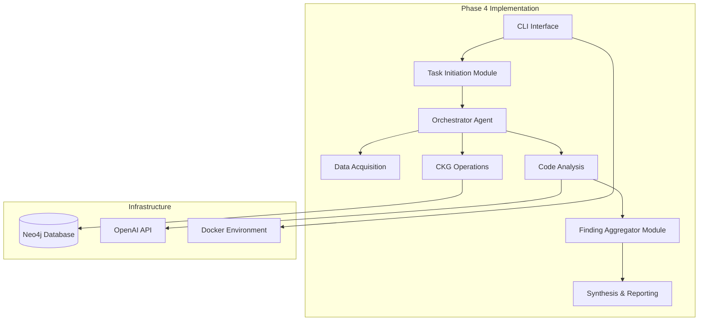

# 📚 RepoChat Phase 4 - Complete Setup Documentation

**Hướng dẫn hoàn chỉnh để setup và test RepoChat Phase 4**

## 📖 Tài liệu Hướng dẫn

### 🚀 [Quick Start Guide](QUICK_START_PHASE_4.md)
**Setup nhanh trong 5 phút**
- Minimal setup steps
- Essential commands
- Quick troubleshooting
- Success validation

### 📋 [Complete Setup Guide](PHASE_4_SETUP_GUIDE.md)  
**Hướng dẫn chi tiết và comprehensive**
- Detailed environment setup
- OpenAI API configuration
- Comprehensive manual testing
- Performance benchmarks
- Advanced troubleshooting
- Monitoring & metrics

### 🎬 [Interactive Demo Script](demo_phase_4.sh)
**Automated demonstration của tất cả Phase 4 features**
- Comprehensive feature showcase
- Performance timing
- Automated validation
- Real repository testing

## 🎯 Phase 4 Current Status

```
✅ COMPLETED TASKS (4/9):
├── Task 4.1: CLI Interface với scan-project
├── Task 4.2: CLI extension với review-pr  
├── Task 4.3: TaskInitiationModule
└── Task 4.4: FindingAggregatorModule

🚧 IN PROGRESS TASKS (5/9):
├── Task 4.5: ReportGeneratorModule
├── Task 4.6: PR Impact Integration
├── Task 4.7: OutputFormatterModule
├── Task 4.8: PresentationModule
└── Task 4.9: Q&A Functionality
```

## 🏁 Getting Started

### 1. Quick Setup (5 minutes)
```bash
# Follow quick start guide
cat QUICK_START_PHASE_4.md

# Or run step by step:
cp env.example .env
echo "OPENAI_API_KEY=sk-your-key" >> .env
docker-compose up -d
```

### 2. Comprehensive Setup
```bash
# Follow complete setup guide
cat PHASE_4_SETUP_GUIDE.md

# Includes detailed configuration, troubleshooting, monitoring
```

### 3. Run Demo
```bash
# Automated demonstration
./demo_phase_4.sh

# Shows all implemented features với performance metrics
```

## 🧪 Testing Commands

```bash
# Quick validation
docker-compose exec backend python repochat_cli.py status

# Test scan project
docker-compose exec backend python repochat_cli.py scan-project https://github.com/spring-projects/spring-petclinic.git -v

# Test review PR
docker-compose exec backend python repochat_cli.py review-pr https://github.com/spring-projects/spring-petclinic.git 123 -v

# Test finding aggregator
docker-compose exec backend python -m pytest tests/test_task_4_4_finding_aggregator.py -v

# Verify foundation
docker-compose exec backend python tests/phase_3_specific/phase_3_completion_test.py
```

## 📊 Architecture Overview



## 🔧 Configuration Files

| File | Purpose | Documentation |
|------|---------|---------------|
| `.env` | Environment variables | [Complete Setup Guide](PHASE_4_SETUP_GUIDE.md#3-configure-environment-variables) |
| `docker-compose.yml` | Service orchestration | [Complete Setup Guide](PHASE_4_SETUP_GUIDE.md#4-start-services) |
| `backend/requirements.txt` | Python dependencies | Auto-handled by Docker |

## 🎯 Key Features Ready for Testing

### ✅ CLI Interface (Task 4.1)
- `scan-project` command
- Vietnamese interface
- Verbose logging
- Error handling

### ✅ PR Review (Task 4.2)  
- `review-pr` command
- PR ID và URL support
- Integration với data acquisition
- Progress reporting

### ✅ Task Management (Task 4.3)
- TaskDefinition creation
- Repository URL validation
- PR parameter handling
- Orchestrator integration

### ✅ Finding Aggregation (Task 4.4)
- Deduplication algorithms
- Severity-based filtering
- Comprehensive statistics
- Configuration options

## 📈 Performance Expectations

| Operation | Small Project | Medium Project | Large Project |
|-----------|---------------|----------------|---------------|
| **CLI Execution** | <10s | <30s | <90s |
| **Repository Clone** | <2s | <5s | <10s |
| **Language Detection** | <0.5s | <1s | <2s |
| **Total Processing** | <15s | <45s | <120s |

## 🛠️ System Requirements

- **RAM**: 8GB minimum (16GB recommended)
- **Storage**: 5GB free space
- **Docker**: v20.10+
- **Network**: Internet cho Docker images và OpenAI API
- **OpenAI API**: Valid key với available credits

## 🐛 Common Issues & Solutions

### OpenAI API Issues
```bash
# Check configuration
cat .env | grep OPENAI_API_KEY
docker-compose restart backend
```

### Neo4j Connection Issues  
```bash
# Verify Neo4j status
docker-compose ps neo4j
docker-compose exec neo4j cypher-shell -u neo4j -p repochat123 'RETURN 1'
```

### Import/Path Issues
```bash
# Check Python path
docker-compose exec backend echo $PYTHONPATH
# Should output: /app/src
```

## 📞 Support & Troubleshooting

1. **Check [Quick Start Guide](QUICK_START_PHASE_4.md)** for immediate issues
2. **Consult [Complete Setup Guide](PHASE_4_SETUP_GUIDE.md)** for detailed troubleshooting
3. **Run [Demo Script](demo_phase_4.sh)** to validate full functionality
4. **Check logs**: `docker-compose logs backend`
5. **Verify environment**: `cat .env`

## 🎉 Success Validation

Hệ thống được coi là setup thành công khi:

- ✅ All CLI commands execute without errors
- ✅ Phase 3 completion test = 100% pass rate  
- ✅ Neo4j accessible at http://localhost:7474
- ✅ Response times meet performance benchmarks
- ✅ Demo script completes successfully

## 🔗 Next Steps

Sau khi Phase 4 setup thành công:

1. **Continue Phase 4 Development** (Tasks 4.5-4.9)
2. **Move to Phase 5** (Vue.js Frontend)
3. **Optimize Performance** (Response time, memory usage)
4. **Prepare for Production** (Security, scalability)

---

**📋 Summary:**
- **Quick Setup**: [QUICK_START_PHASE_4.md](QUICK_START_PHASE_4.md) ⚡
- **Complete Guide**: [PHASE_4_SETUP_GUIDE.md](PHASE_4_SETUP_GUIDE.md) 📚
- **Demo Script**: `./demo_phase_4.sh` 🎬
- **Status**: Phase 4 (4/9 tasks completed) 🚧

**🚀 RepoChat v1.0 Phase 4 is ready for development!** 