# RepoChat v1.0 - Dataflow Architecture (Phase 1 & 2)

## 📊 Overview

This document describes the complete dataflow architecture for RepoChat v1.0 covering Phase 1 (Data Acquisition) and Phase 2 (CKG Operations).

## 🎯 High-Level Dataflow

```mermaid
graph TB
    subgraph "PHASE 1: DATA ACQUISITION"
        A["👤 User Request<br/>Repository URL"] --> B["🎯 OrchestratorAgent<br/>Initialize"]
        B --> C["🔐 PAT Handler<br/>Check Auth Requirements"]
        C --> D["📂 Git Operations<br/>Clone Repository"]
        D --> E["🔍 Language Identifier<br/>Detect Languages"]
        E --> F["📋 Data Preparation<br/>Create ProjectDataContext"]
        F --> G["✅ Phase 1 Complete<br/>ProjectDataContext Ready"]
    end
    
    subgraph "PHASE 2: CKG OPERATIONS"  
        G --> H["🧠 Code Parser Coordinator<br/>Initialize Parsers"]
        H --> I["☕ Java Parser<br/>Parse AST"]
        H --> J["🐍 Python Parser<br/>Mock Parser"]
        H --> K["📱 Kotlin Parser<br/>Mock Parser"]
        
        I --> L["📊 Coordinator Parse Result<br/>Aggregate Results"]
        J --> L
        K --> L
        
        L --> M["🗄️ Neo4j Connection<br/>Database Setup"]
        M --> N["🏗️ AST to CKG Builder<br/>Transform & Store"]
        N --> O["🔗 Create Nodes<br/>Classes, Methods, Fields"]
        O --> P["🔗 Create Relationships<br/>CALLS, CONTAINS"]
        P --> Q["🔍 CKG Query Interface<br/>Analysis Ready"]
        Q --> R["✅ Phase 2 Complete<br/>CKG Database Ready"]
    end
    
    subgraph "DATA FLOW"
        S["🌐 Repository"] --> D
        T["📁 File System"] --> E
        U["🎯 ProjectDataContext"] --> H
        V["📊 ParseResults"] --> N
        W["🗄️ Neo4j Database"] --> Q
    end
    
    style A fill:#e1f5fe
    style G fill:#e8f5e8
    style R fill:#fff3e0
```



## 🔵 Phase 1: Data Acquisition

### Input/Output Flow

| **Component** | **Input** | **Output** | **Storage** |
|---------------|-----------|------------|-------------|
| **OrchestratorAgent** | Repository URL | Agent Instance | Memory |
| **PAT Handler** | Repository URL | Auth Status | None |
| **Git Operations** | Repository URL | Local Clone Path | File System |
| **Language Identifier** | Clone Path | Language List + File Counts | None |
| **Data Preparation** | Clone Path + Languages | ProjectDataContext | Memory |

### Data Structures

**ProjectDataContext**:
```python
{
    "repository_url": str,
    "cloned_path": str,
    "detected_languages": List[str],
    "primary_language": str,
    "language_file_counts": Dict[str, int],
    "total_files": int,
    "supported_languages": List[str]
}
```

## 🟢 Phase 2: CKG Operations

### Input/Output Flow

| **Component** | **Input** | **Output** | **Storage** |
|---------------|-----------|------------|-------------|
| **Code Parser Coordinator** | ProjectDataContext | CoordinatorParseResult | Memory |
| **Java Parser** | Java Files | Language Parse Results | Memory |
| **Python/Kotlin Parsers** | Source Files | Mock Parse Results | Memory |
| **Neo4j Connection** | Config | Database Session | Neo4j DB |
| **AST to CKG Builder** | Parse Results | CKG Build Result | Neo4j DB |
| **CKG Query Interface** | Project Name | Analysis Results | Neo4j DB |

### Data Structures

**CoordinatorParseResult**:
```python
{
    "success": bool,
    "language_results": Dict[str, LanguageParseResult],
    "total_files_parsed": int,
    "total_entities_found": int,
    "parsing_duration_ms": float,
    "errors": List[str]
}
```

**CKGBuildResult**:
```python
{
    "success": bool,
    "nodes_created": int,
    "relationships_created": int,
    "files_processed": int,
    "build_duration_ms": float,
    "errors": List[str],
    "warnings": List[str]
}
```

## 🗄️ Neo4j Graph Schema

### Node Types
- **Project**: Repository metadata
- **File**: Source code files
- **Class**: Java classes and interfaces
- **Method**: Java methods and constructors
- **Field**: Java class fields

### Relationship Types
- **CONTAINS**: File → Class, Class → Method/Field
- **CALLS**: Method → Method
- **IMPLEMENTS**: Class → Interface
- **EXTENDS**: Class → Class

## 📈 Performance Metrics

| **Phase** | **Component** | **Target Time** | **Achieved** |
|-----------|---------------|-----------------|--------------|
| Phase 1 | Repository Clone | < 30s | ~2s |
| Phase 1 | Language Detection | < 5s | ~0.01s |
| Phase 1 | Data Preparation | < 1s | ~0.001s |
| Phase 2 | Code Parsing | < 60s | ~0.1s |
| Phase 2 | CKG Building | < 120s | ~0.7s |
| Phase 2 | Query Interface | < 5s | ~0.75s |

## 🔄 End-to-End Integration

Total workflow time: **~5.76 seconds** for Spring PetClinic (42 Java files, 38 classes, 146 methods)

Result: **298 nodes, 26 relationships** in Neo4j CKG database. 