# 🔍 Phase 1 - Chi tiết Sequence Diagrams

**Tài liệu Phân tích**: Detailed Sequence Diagrams for Phase 1 Components  
**Ngày tạo**: 2025-06-05  
**Phiên bản**: 1.0  

## 📋 Mục lục

1. [GitOperationsModule Detailed Flow](#git-operations-module)
2. [LanguageIdentifierModule Detailed Flow](#language-identifier-module)
3. [PATHandlerModule Detailed Flow](#pat-handler-module)
4. [DataPreparationModule Detailed Flow](#data-preparation-module)
5. [Logging System Integration](#logging-system-integration)
6. [Error Handling Workflows](#error-handling-workflows)
7. [Testing Workflows](#testing-workflows)

---

## 🔧 GitOperationsModule Detailed Flow {#git-operations-module}

### Complete Git Clone Sequence

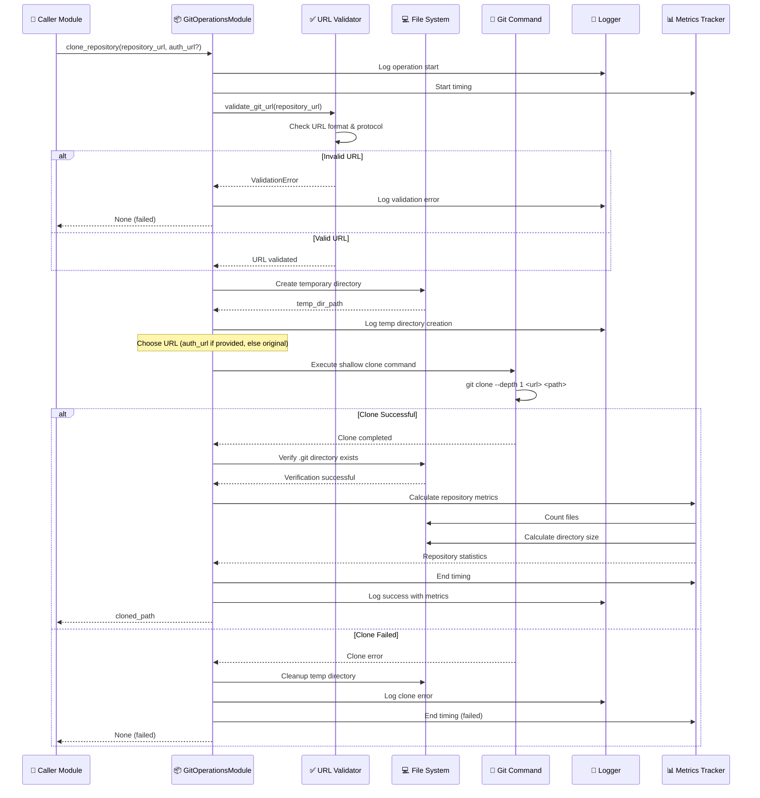
```mermaid
sequenceDiagram
    participant Caller as 🎯 Caller Module
    participant Git as 📦 GitOperationsModule
    participant Validator as ✅ URL Validator
    participant System as 💻 File System
    participant GitCmd as 🔧 Git Command
    participant Logger as 📝 Logger
    participant Metrics as 📊 Metrics Tracker

    Caller->>Git: clone_repository(repository_url, auth_url?)
    Git->>Logger: Log operation start
    Git->>Metrics: Start timing
    
    Git->>Validator: validate_git_url(repository_url)
    Validator->>Validator: Check URL format & protocol
    alt Invalid URL
        Validator-->>Git: ValidationError
        Git->>Logger: Log validation error
        Git-->>Caller: None (failed)
    else Valid URL
        Validator-->>Git: URL validated
    end
    
    Git->>System: Create temporary directory
    System-->>Git: temp_dir_path
    Git->>Logger: Log temp directory creation
    
    Note over Git: Choose URL (auth_url if provided, else original)
    Git->>GitCmd: Execute shallow clone command
    GitCmd->>GitCmd: git clone --depth 1 <url> <path>
    
    alt Clone Successful
        GitCmd-->>Git: Clone completed
        Git->>System: Verify .git directory exists
        System-->>Git: Verification successful
        
        Git->>Metrics: Calculate repository metrics
        Metrics->>System: Count files
        Metrics->>System: Calculate directory size
        Metrics-->>Git: Repository statistics
        
        Git->>Metrics: End timing
        Git->>Logger: Log success with metrics
        Git-->>Caller: cloned_path
        
    else Clone Failed
        GitCmd-->>Git: Clone error
        Git->>System: Cleanup temp directory
        Git->>Logger: Log clone error
        Git->>Metrics: End timing (failed)
        Git-->>Caller: None (failed)
    end
```

### Git URL Validation Detail

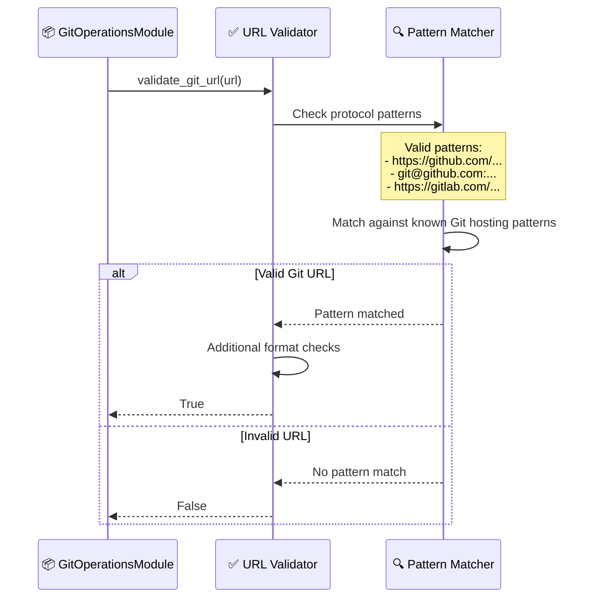
```mermaid
sequenceDiagram
    participant Git as 📦 GitOperationsModule
    participant Validator as ✅ URL Validator
    participant Patterns as 🔍 Pattern Matcher

    Git->>Validator: validate_git_url(url)
    Validator->>Patterns: Check protocol patterns
    
    Note over Patterns: Valid patterns:<br/>- https://github.com/...<br/>- git@github.com:...<br/>- https://gitlab.com/...
    
    Patterns->>Patterns: Match against known Git hosting patterns
    
    alt Valid Git URL
        Patterns-->>Validator: Pattern matched
        Validator->>Validator: Additional format checks
        Validator-->>Git: True
    else Invalid URL
        Patterns-->>Validator: No pattern match
        Validator-->>Git: False
    end
```

---

## 🔍 LanguageIdentifierModule Detailed Flow {#language-identifier-module}

### Complete Language Detection Sequence

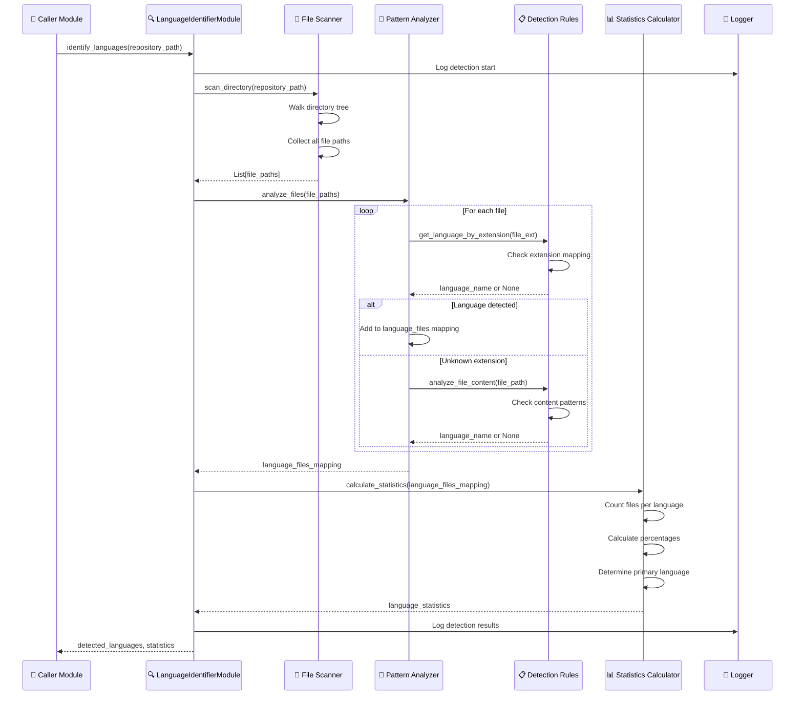
```mermaid
sequenceDiagram
    participant Caller as 🎯 Caller Module
    participant Lang as 🔍 LanguageIdentifierModule
    participant Scanner as 📁 File Scanner
    participant Analyzer as 🔬 Pattern Analyzer
    participant Rules as 📋 Detection Rules
    participant Stats as 📊 Statistics Calculator
    participant Logger as 📝 Logger

    Caller->>Lang: identify_languages(repository_path)
    Lang->>Logger: Log detection start
    
    Lang->>Scanner: scan_directory(repository_path)
    Scanner->>Scanner: Walk directory tree
    Scanner->>Scanner: Collect all file paths
    Scanner-->>Lang: List[file_paths]
    
    Lang->>Analyzer: analyze_files(file_paths)
    
    loop For each file
        Analyzer->>Rules: get_language_by_extension(file_ext)
        Rules->>Rules: Check extension mapping
        Rules-->>Analyzer: language_name or None
        
        alt Language detected
            Analyzer->>Analyzer: Add to language_files mapping
        else Unknown extension
            Analyzer->>Rules: analyze_file_content(file_path)
            Rules->>Rules: Check content patterns
            Rules-->>Analyzer: language_name or None
        end
    end
    
    Analyzer-->>Lang: language_files_mapping
    
    Lang->>Stats: calculate_statistics(language_files_mapping)
    Stats->>Stats: Count files per language
    Stats->>Stats: Calculate percentages
    Stats->>Stats: Determine primary language
    Stats-->>Lang: language_statistics
    
    Lang->>Logger: Log detection results
    Lang-->>Caller: detected_languages, statistics
```

### Language Detection Rules Flow

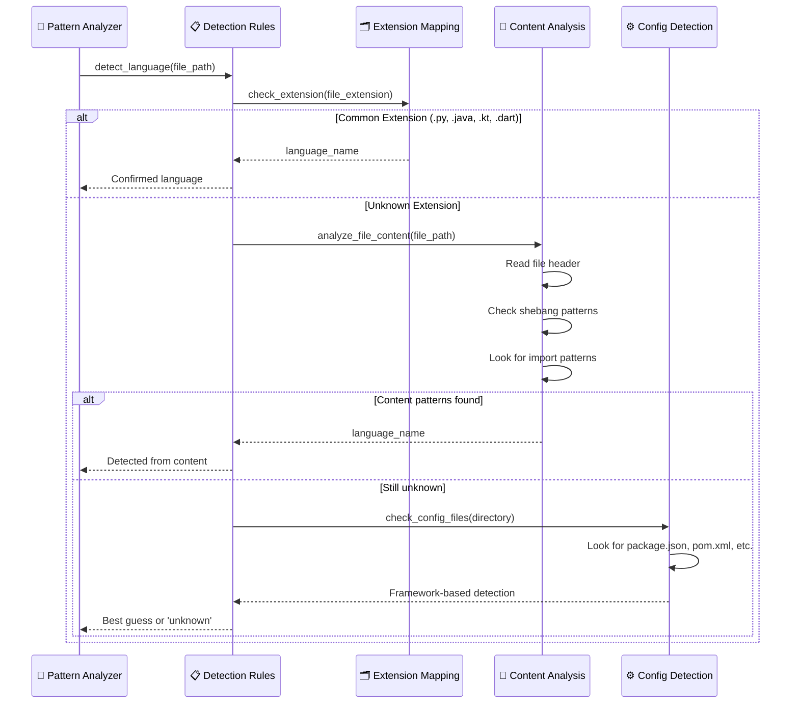
```mermaid
sequenceDiagram
    participant Analyzer as 🔬 Pattern Analyzer
    participant Rules as 📋 Detection Rules
    participant ExtMap as 🗂️ Extension Mapping
    participant Content as 📄 Content Analysis
    participant Config as ⚙️ Config Detection

    Analyzer->>Rules: detect_language(file_path)
    Rules->>ExtMap: check_extension(file_extension)
    
    alt Common Extension (.py, .java, .kt, .dart)
        ExtMap-->>Rules: language_name
        Rules-->>Analyzer: Confirmed language
    else Unknown Extension
        Rules->>Content: analyze_file_content(file_path)
        Content->>Content: Read file header
        Content->>Content: Check shebang patterns
        Content->>Content: Look for import patterns
        
        alt Content patterns found
            Content-->>Rules: language_name
            Rules-->>Analyzer: Detected from content
        else Still unknown
            Rules->>Config: check_config_files(directory)
            Config->>Config: Look for package.json, pom.xml, etc.
            Config-->>Rules: Framework-based detection
            Rules-->>Analyzer: Best guess or 'unknown'
        end
    end
```

---

## 🔐 PATHandlerModule Detailed Flow {#pat-handler-module}

### Private Repository Detection & PAT Handling

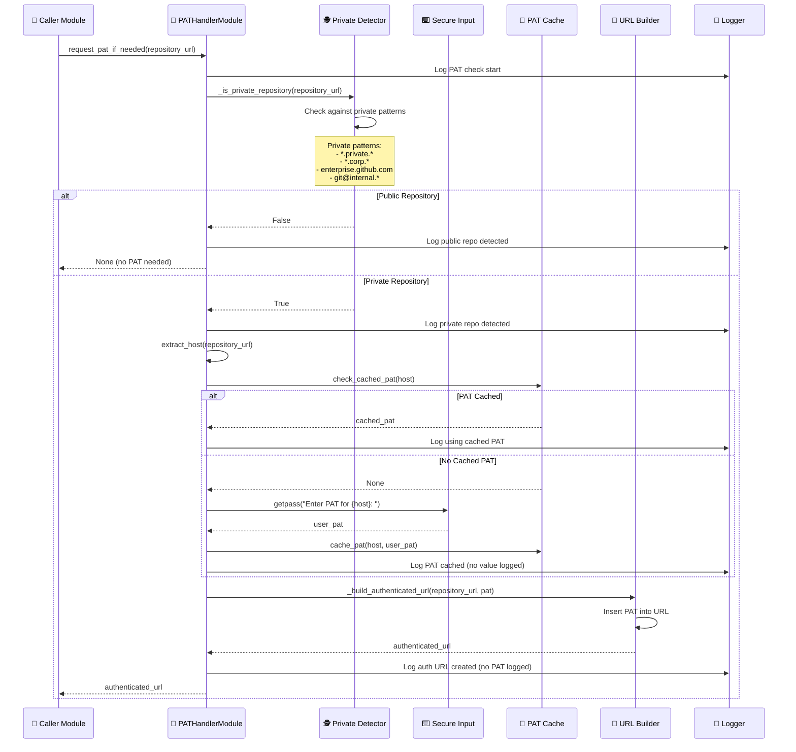
```mermaid
sequenceDiagram
    participant Caller as 🎯 Caller Module
    participant PAT as 🔐 PATHandlerModule
    participant Detector as 🕵️ Private Detector
    participant Input as ⌨️ Secure Input
    participant Cache as 💾 PAT Cache
    participant Builder as 🔗 URL Builder
    participant Logger as 📝 Logger

    Caller->>PAT: request_pat_if_needed(repository_url)
    PAT->>Logger: Log PAT check start
    
    PAT->>Detector: _is_private_repository(repository_url)
    Detector->>Detector: Check against private patterns
    
    Note over Detector: Private patterns:<br/>- *.private.*<br/>- *.corp.*<br/>- enterprise.github.com<br/>- git@internal.*
    
    alt Public Repository
        Detector-->>PAT: False
        PAT->>Logger: Log public repo detected
        PAT-->>Caller: None (no PAT needed)
        
    else Private Repository
        Detector-->>PAT: True
        PAT->>Logger: Log private repo detected
        
        PAT->>PAT: extract_host(repository_url)
        PAT->>Cache: check_cached_pat(host)
        
        alt PAT Cached
            Cache-->>PAT: cached_pat
            PAT->>Logger: Log using cached PAT
            
        else No Cached PAT
            Cache-->>PAT: None
            PAT->>Input: getpass("Enter PAT for {host}: ")
            Input-->>PAT: user_pat
            PAT->>Cache: cache_pat(host, user_pat)
            PAT->>Logger: Log PAT cached (no value logged)
        end
        
        PAT->>Builder: _build_authenticated_url(repository_url, pat)
        Builder->>Builder: Insert PAT into URL
        Builder-->>PAT: authenticated_url
        
        PAT->>Logger: Log auth URL created (no PAT logged)
        PAT-->>Caller: authenticated_url
    end
```

### PAT Security & Cleanup Flow

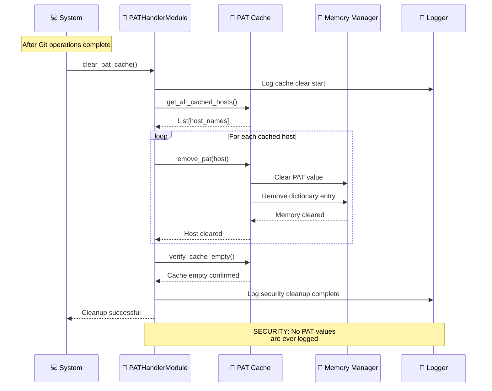
```mermaid
sequenceDiagram
    participant System as 💻 System
    participant PAT as 🔐 PATHandlerModule
    participant Cache as 💾 PAT Cache
    participant Memory as 🧠 Memory Manager
    participant Logger as 📝 Logger

    Note over System: After Git operations complete
    System->>PAT: clear_pat_cache()
    PAT->>Logger: Log cache clear start
    
    PAT->>Cache: get_all_cached_hosts()
    Cache-->>PAT: List[host_names]
    
    loop For each cached host
        PAT->>Cache: remove_pat(host)
        Cache->>Memory: Clear PAT value
        Cache->>Memory: Remove dictionary entry
        Memory-->>Cache: Memory cleared
        Cache-->>PAT: Host cleared
    end
    
    PAT->>Cache: verify_cache_empty()
    Cache-->>PAT: Cache empty confirmed
    
    PAT->>Logger: Log security cleanup complete
    PAT-->>System: Cleanup successful
    
    Note over PAT,Logger: SECURITY: No PAT values<br/>are ever logged
```

---

## 📊 DataPreparationModule Detailed Flow {#data-preparation-module}

### ProjectDataContext Creation Sequence

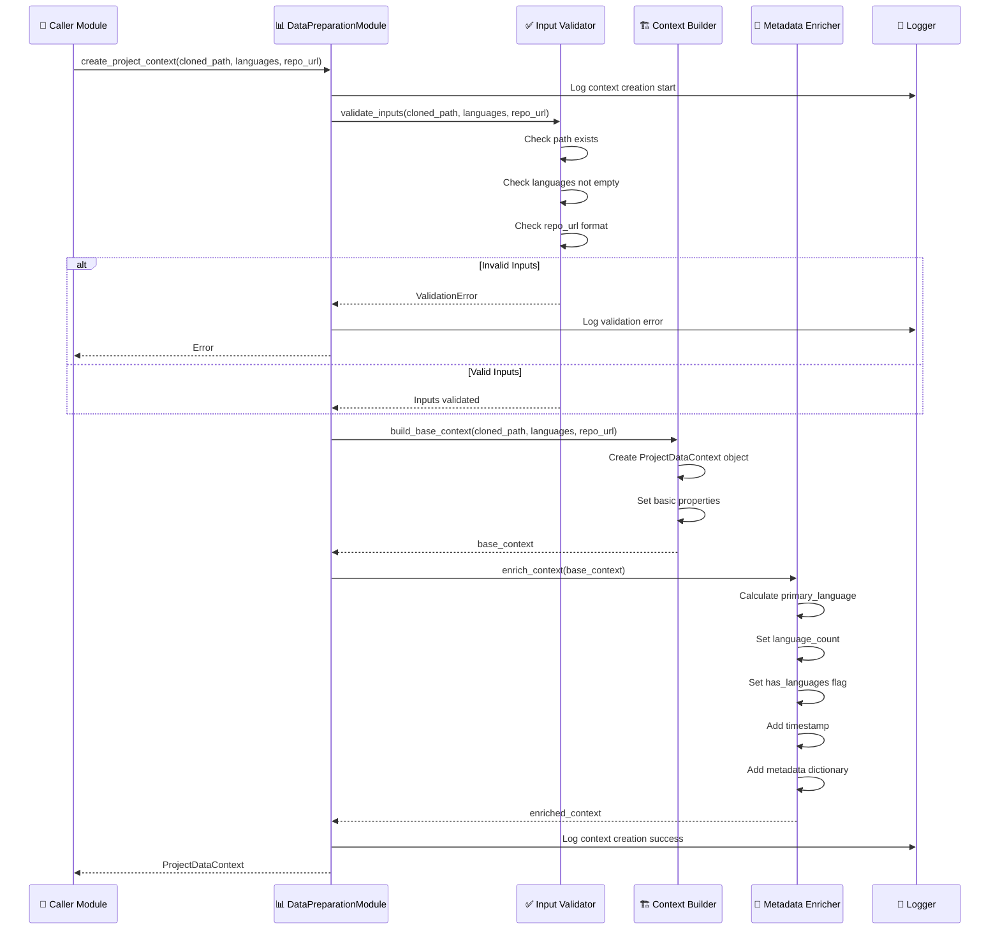
```mermaid
sequenceDiagram
    participant Caller as 🎯 Caller Module
    participant Data as 📊 DataPreparationModule
    participant Validator as ✅ Input Validator
    participant Builder as 🏗️ Context Builder
    participant Enricher as 🎨 Metadata Enricher
    participant Logger as 📝 Logger

    Caller->>Data: create_project_context(cloned_path, languages, repo_url)
    Data->>Logger: Log context creation start
    
    Data->>Validator: validate_inputs(cloned_path, languages, repo_url)
    Validator->>Validator: Check path exists
    Validator->>Validator: Check languages not empty
    Validator->>Validator: Check repo_url format
    
    alt Invalid Inputs
        Validator-->>Data: ValidationError
        Data->>Logger: Log validation error
        Data-->>Caller: Error
    else Valid Inputs
        Validator-->>Data: Inputs validated
    end
    
    Data->>Builder: build_base_context(cloned_path, languages, repo_url)
    Builder->>Builder: Create ProjectDataContext object
    Builder->>Builder: Set basic properties
    Builder-->>Data: base_context
    
    Data->>Enricher: enrich_context(base_context)
    Enricher->>Enricher: Calculate primary_language
    Enricher->>Enricher: Set language_count
    Enricher->>Enricher: Set has_languages flag
    Enricher->>Enricher: Add timestamp
    Enricher->>Enricher: Add metadata dictionary
    Enricher-->>Data: enriched_context
    
    Data->>Logger: Log context creation success
    Data-->>Caller: ProjectDataContext
```

### Context Enrichment Detail

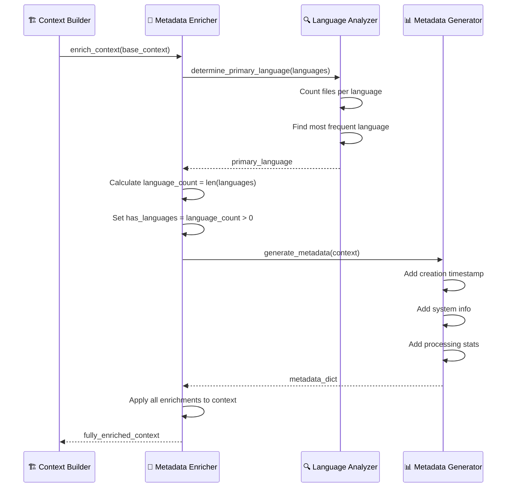
```mermaid
sequenceDiagram
    participant Builder as 🏗️ Context Builder
    participant Enricher as 🎨 Metadata Enricher
    participant LangAnalyzer as 🔍 Language Analyzer
    participant MetaGen as 📊 Metadata Generator

    Builder->>Enricher: enrich_context(base_context)
    
    Enricher->>LangAnalyzer: determine_primary_language(languages)
    LangAnalyzer->>LangAnalyzer: Count files per language
    LangAnalyzer->>LangAnalyzer: Find most frequent language
    LangAnalyzer-->>Enricher: primary_language
    
    Enricher->>Enricher: Calculate language_count = len(languages)
    Enricher->>Enricher: Set has_languages = language_count > 0
    
    Enricher->>MetaGen: generate_metadata(context)
    MetaGen->>MetaGen: Add creation timestamp
    MetaGen->>MetaGen: Add system info
    MetaGen->>MetaGen: Add processing stats
    MetaGen-->>Enricher: metadata_dict
    
    Enricher->>Enricher: Apply all enrichments to context
    Enricher-->>Builder: fully_enriched_context
```

---

## 📝 Logging System Integration {#logging-system-integration}

### Structured Logging Flow

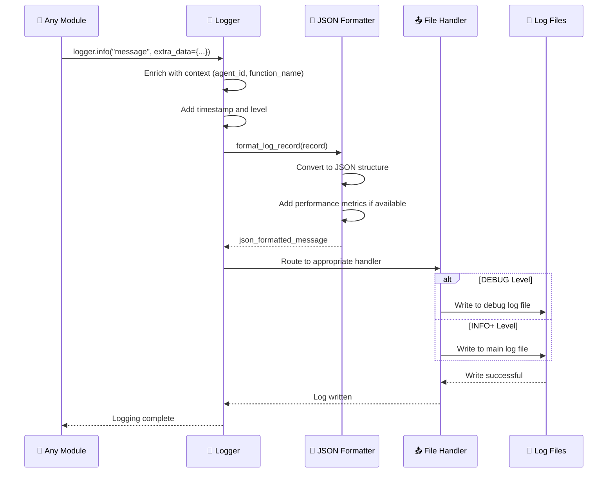
```mermaid
sequenceDiagram
    participant Module as 🔧 Any Module
    participant Logger as 📝 Logger
    participant Formatter as 🎨 JSON Formatter
    participant Handler as 📤 File Handler
    participant Files as 📁 Log Files

    Module->>Logger: logger.info("message", extra_data={...})
    Logger->>Logger: Enrich with context (agent_id, function_name)
    Logger->>Logger: Add timestamp and level
    
    Logger->>Formatter: format_log_record(record)
    Formatter->>Formatter: Convert to JSON structure
    Formatter->>Formatter: Add performance metrics if available
    Formatter-->>Logger: json_formatted_message
    
    Logger->>Handler: Route to appropriate handler
    
    alt DEBUG Level
        Handler->>Files: Write to debug log file
    else INFO+ Level
        Handler->>Files: Write to main log file
    end
    
    Files-->>Handler: Write successful
    Handler-->>Logger: Log written
    Logger-->>Module: Logging complete
```

### Performance Metrics Logging

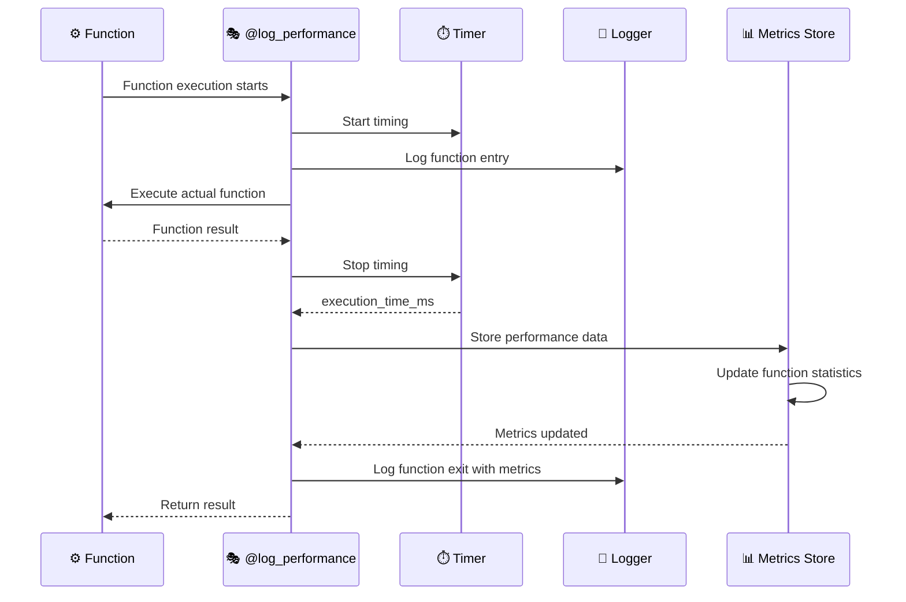
```mermaid
sequenceDiagram
    participant Function as ⚙️ Function
    participant Decorator as 🎭 @log_performance
    participant Timer as ⏱️ Timer
    participant Logger as 📝 Logger
    participant Metrics as 📊 Metrics Store

    Function->>Decorator: Function execution starts
    Decorator->>Timer: Start timing
    Decorator->>Logger: Log function entry
    
    Decorator->>Function: Execute actual function
    Function-->>Decorator: Function result
    
    Decorator->>Timer: Stop timing
    Timer-->>Decorator: execution_time_ms
    
    Decorator->>Metrics: Store performance data
    Metrics->>Metrics: Update function statistics
    Metrics-->>Decorator: Metrics updated
    
    Decorator->>Logger: Log function exit with metrics
    Decorator-->>Function: Return result
```

---

## ⚠️ Error Handling Workflows {#error-handling-workflows}

### Generic Error Handling Pattern

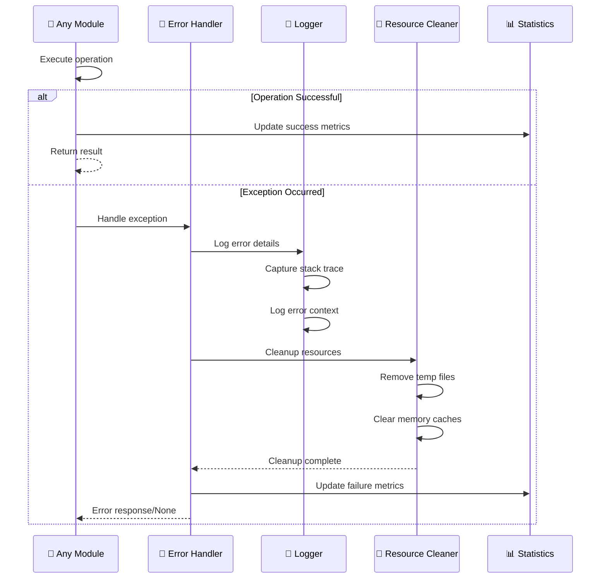
```mermaid
sequenceDiagram
    participant Module as 🔧 Any Module
    participant ErrorHandler as 🚨 Error Handler
    participant Logger as 📝 Logger
    participant Cleaner as 🧹 Resource Cleaner
    participant Stats as 📊 Statistics

    Module->>Module: Execute operation
    
    alt Operation Successful
        Module->>Stats: Update success metrics
        Module-->>Module: Return result
    else Exception Occurred
        Module->>ErrorHandler: Handle exception
        
        ErrorHandler->>Logger: Log error details
        Logger->>Logger: Capture stack trace
        Logger->>Logger: Log error context
        
        ErrorHandler->>Cleaner: Cleanup resources
        Cleaner->>Cleaner: Remove temp files
        Cleaner->>Cleaner: Clear memory caches
        Cleaner-->>ErrorHandler: Cleanup complete
        
        ErrorHandler->>Stats: Update failure metrics
        ErrorHandler-->>Module: Error response/None
    end
```

### Network Error Handling (Git Operations)

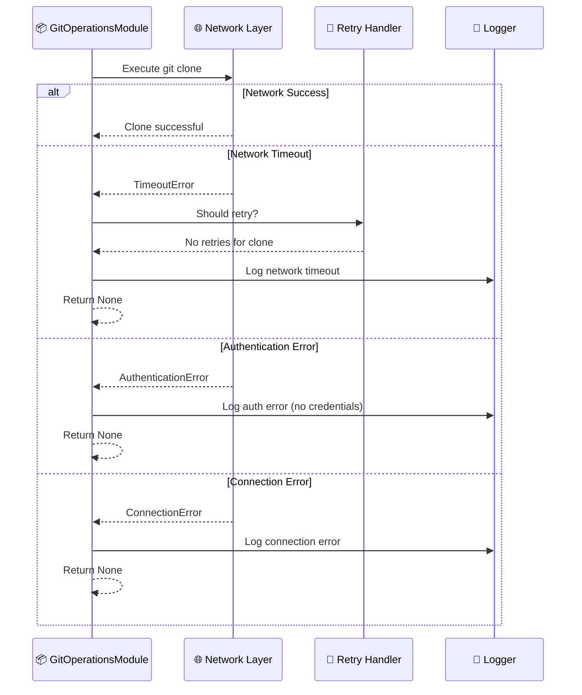
```mermaid
sequenceDiagram
    participant Git as 📦 GitOperationsModule
    participant Network as 🌐 Network Layer
    participant Retry as 🔄 Retry Handler
    participant Logger as 📝 Logger

    Git->>Network: Execute git clone
    
    alt Network Success
        Network-->>Git: Clone successful
    else Network Timeout
        Network-->>Git: TimeoutError
        Git->>Retry: Should retry?
        Retry-->>Git: No retries for clone
        Git->>Logger: Log network timeout
        Git-->>Git: Return None
    else Authentication Error
        Network-->>Git: AuthenticationError
        Git->>Logger: Log auth error (no credentials)
        Git-->>Git: Return None
    else Connection Error
        Network-->>Git: ConnectionError
        Git->>Logger: Log connection error
        Git-->>Git: Return None
    end
```

---

## 🧪 Testing Workflows {#testing-workflows}

### Unit Test Execution Flow

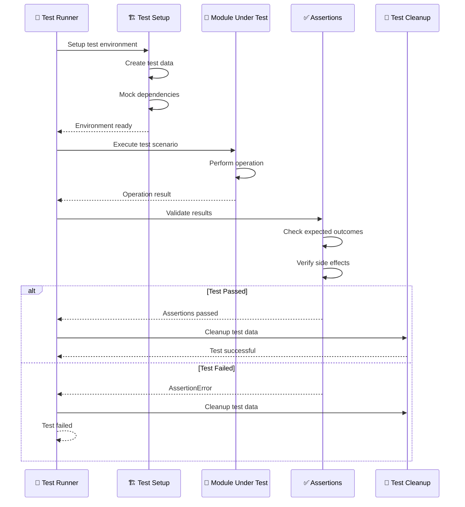
```mermaid
sequenceDiagram
    participant Test as 🧪 Test Runner
    participant Setup as 🏗️ Test Setup
    participant Module as 🔧 Module Under Test
    participant Assert as ✅ Assertions
    participant Cleanup as 🧹 Test Cleanup

    Test->>Setup: Setup test environment
    Setup->>Setup: Create test data
    Setup->>Setup: Mock dependencies
    Setup-->>Test: Environment ready
    
    Test->>Module: Execute test scenario
    Module->>Module: Perform operation
    Module-->>Test: Operation result
    
    Test->>Assert: Validate results
    Assert->>Assert: Check expected outcomes
    Assert->>Assert: Verify side effects
    
    alt Test Passed
        Assert-->>Test: Assertions passed
        Test->>Cleanup: Cleanup test data
        Cleanup-->>Test: Test successful
    else Test Failed
        Assert-->>Test: AssertionError
        Test->>Cleanup: Cleanup test data
        Test-->>Test: Test failed
    end
```

### Integration Test Flow

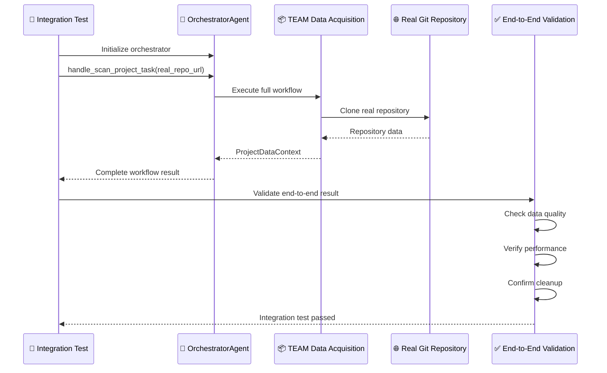
```mermaid
sequenceDiagram
    participant IntTest as 🔗 Integration Test
    participant Orch as 🎯 OrchestratorAgent
    participant TDA as 📦 TEAM Data Acquisition
    participant RealGit as 🌐 Real Git Repository
    participant Validation as ✅ End-to-End Validation

    IntTest->>Orch: Initialize orchestrator
    IntTest->>Orch: handle_scan_project_task(real_repo_url)
    
    Orch->>TDA: Execute full workflow
    TDA->>RealGit: Clone real repository
    RealGit-->>TDA: Repository data
    TDA-->>Orch: ProjectDataContext
    
    Orch-->>IntTest: Complete workflow result
    
    IntTest->>Validation: Validate end-to-end result
    Validation->>Validation: Check data quality
    Validation->>Validation: Verify performance
    Validation->>Validation: Confirm cleanup
    Validation-->>IntTest: Integration test passed
```

---

## 📊 Summary

Phase 1 đã triển khai một hệ thống phức tạp với:

- **6 modules** hoạt động phối hợp nhịp nhàng
- **Structured logging** với JSON format
- **Comprehensive error handling** cho tất cả edge cases
- **Security-first approach** với PAT handling
- **Performance monitoring** tích hợp
- **100+ unit tests** với end-to-end validation

Tất cả các sequence diagrams trên mô tả chính xác cách các component tương tác trong thực tế, tạo foundation vững chắc cho Phase 2 development.

---

## 🔗 Related Documents

- **PHASE1_DATA_FLOW_ANALYSIS.md**: High-level data flow overview
- **DESIGN.md**: Overall system architecture
- **TASK.md**: Implementation progress tracking
- **Source Code**: `backend/src/` - Actual implementation 