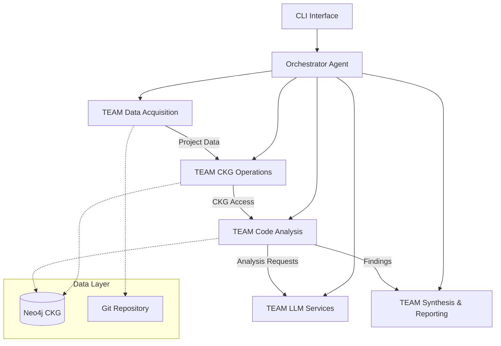

# RepoChat v1.0 - Complete Developer Guide

**Version:** 1.0  
**Last Updated:** 2025-06-06  
**Project Status:** Phase 3 Completed, Ready for Phase 4

---

## 📋 Table of Contents

1. [Project Overview](#project-overview)
2. [Architecture Overview](#architecture-overview)
3. [Development Progress](#development-progress)
4. [Installation & Setup](#installation--setup)
5. [Testing Guide](#testing-guide)
6. [API Documentation](#api-documentation)
7. [Deployment Guide](#deployment-guide)
8. [Troubleshooting](#troubleshooting)
9. [Contributing](#contributing)

---

## 📊 Project Overview

RepoChat v1.0 là một trợ lý AI thông minh cho việc review code và phân tích repository, được thiết kế như một "đồng đội ảo" thế hệ mới cho các nhà phát triển. Dự án sử dụng kiến trúc đa agent (Multi-Agent System) với các TEAM chuyên biệt phối hợp để thực hiện phân tích code toàn diện.

### 🎯 Core Capabilities

- **Intelligent Code Analysis:** Phát hiện circular dependencies, unused elements, architectural issues
- **PR Impact Analysis:** Phân tích tác động của Pull Request thông qua Code Knowledge Graph
- **LLM Integration:** Tích hợp với OpenAI cho code explanation và analysis
- **Multi-Language Support:** Java, Python, Kotlin, Dart với extensible parser framework
- **Graph-Based Analysis:** Sử dụng Neo4j Code Knowledge Graph cho deep code relationships

### 🏗️ Multi-Agent Architecture

#### TEAM Data Acquisition
- **GitOperationsModule:** Clone repositories, extract PR diffs
- **LanguageIdentifierModule:** Detect programming languages
- **DataPreparationModule:** Prepare and validate project context
- **PATHandlerModule:** Secure handling of Personal Access Tokens

#### TEAM CKG Operations  
- **CodeParserCoordinatorModule:** Coordinate multiple language parsers
- **ASTtoCKGBuilderModule:** Convert AST to Neo4j graph representation
- **Neo4jConnectionModule:** Database operations and query interface
- **CKGQueryInterfaceModule:** High-level graph querying

#### TEAM Code Analysis
- **ArchitecturalAnalyzerModule:** Detect circular dependencies và unused elements
- **PRImpactAnalyzerModule:** Analyze PR impact via graph relationships
- **LLMAnalysisSupportModule:** Bridge code analysis với LLM services
- **StaticAnalysisIntegratorModule:** Framework for external static analysis tools

#### TEAM LLM Services
- **LLMGatewayModule:** Orchestrate LLM requests và responses
- **PromptFormatterModule:** Template-based prompt generation
- **OpenAIProvider:** Complete OpenAI API integration
- **LLMProviderFactory:** Abstract provider management

#### Orchestrator Agent
- **Central coordination:** Route requests between teams
- **Task management:** Handle TaskDefinition và execution flow
- **LLM routing:** Coordinate LLM service requests
- **Error handling:** Comprehensive error management và logging

---

## 🏛️ Architecture Overview

### System Architecture Diagram



### Data Flow Architecture

1. **Input Phase:** Repository URL/PR information
2. **Acquisition Phase:** Clone, language detection, preparation
3. **Parsing Phase:** AST generation cho multiple languages
4. **Graph Building:** Convert AST to Neo4j knowledge graph
5. **Analysis Phase:** Run architectural và impact analysis
6. **LLM Integration:** Code explanation và advanced analysis
7. **Synthesis Phase:** Aggregate findings và generate reports
8. **Output Phase:** Present results to user

### Technology Stack

- **Backend:** Python 3.9+, FastAPI (planned), Pydantic
- **Database:** Neo4j 5.15+ for Code Knowledge Graph
- **LLM Integration:** OpenAI GPT models với provider abstraction
- **Language Parsing:** AST-based parsers (javalang, ast, regex)
- **Testing:** Pytest, comprehensive test coverage
- **Containerization:** Docker và Docker Compose
- **Documentation:** Markdown, API docs

---

## 📈 Development Progress

### ✅ **Phase 1: Data Acquisition & Git Integration** (COMPLETED)
- **Duration:** 2-3 weeks
- **Status:** 100% Complete
- **Key Deliverables:**
  - Git repository cloning và management
  - Language detection for Java, Python, Kotlin, Dart
  - PAT security handling
  - Project data context preparation

### ✅ **Phase 2: Code Parsing & CKG Foundation** (COMPLETED)  
- **Duration:** 3-4 weeks
- **Status:** 100% Complete
- **Key Deliverables:**
  - Multi-language AST parsing (Java, Python, Kotlin, Dart)
  - Neo4j Code Knowledge Graph implementation
  - Graph schema với nodes/relationships
  - Query interface foundation

**Test Results (Spring Pet Clinic):**
- 298 nodes created (1 project + 42 files + 255 entities)
- 564 total relationships (structural + call relationships)
- Performance: 2.02s data acquisition, 0.10s parsing, 0.99s CKG building

### ✅ **Phase 3: Code Analysis & LLM Integration** (COMPLETED)
- **Duration:** 4-5 weeks  
- **Status:** 100% Complete (8/8 tasks)
- **Key Deliverables:**
  - Circular dependency detection
  - Unused element identification
  - OpenAI provider integration
  - Prompt template system
  - PR impact analysis
  - Orchestrator LLM routing

**Test Results:**
- ✅ 8/8 tasks passing
- ✅ 100% success rate
- ✅ All DoD requirements satisfied
- ✅ Comprehensive test coverage

### 🚧 **Phase 4: User Interaction & CLI** (PLANNED)
- **Duration:** 3-4 weeks
- **Status:** Ready to start
- **Planned Deliverables:**
  - CLI interface (`scan_project`, `review_pr`)
  - Report generation và formatting
  - Q&A functionality
  - Basic presentation layer

### 🔮 **Phase 5: Frontend & Advanced Features** (PLANNED)
- Vue.js chat interface
- Settings management
- Diagram generation
- Advanced LLM features

### 🔮 **Phase 6: Deployment & Production** (PLANNED)
- End-to-end testing
- Performance optimization
- Production deployment
- User documentation

---

## 🚀 Installation & Setup

### Prerequisites

- **Python 3.9+**
- **Neo4j 5.15+** 
- **Git**
- **Docker & Docker Compose** (optional)

### Quick Start với Docker

```bash
# 1. Clone repository
git clone https://github.com/your-org/repochat.git
cd repochat

# 2. Start services with Docker Compose
docker-compose up -d

# 3. Wait for Neo4j to be ready
# Neo4j will be available at http://localhost:7474

# 4. Run initial setup
cd backend
python -m scripts.setup.setup_test_environment
```

### Manual Installation

```bash
# 1. Install Python dependencies
cd backend
pip install -r requirements.txt

# 2. Start Neo4j
# Download and start Neo4j 5.15+
# Default: bolt://localhost:7687

# 3. Set environment variables
cp env.example .env
# Edit .env với your settings

# 4. Initialize system
python -m scripts.setup.setup_test_environment
```

### Configuration

Create `.env` file trong backend directory:

```env
# Neo4j Configuration
NEO4J_URI=bolt://localhost:7687
NEO4J_USER=neo4j
NEO4J_PASSWORD=your_password

# OpenAI Configuration (optional for Phase 3 features)
OPENAI_API_KEY=your_openai_api_key

# Logging
LOG_LEVEL=INFO
LOG_FILE=logs/repochat.log
```

### Verification

```bash
# Run basic system test
cd backend
python tests/integration/quick_integration_test.py

# Run comprehensive Phase 1-3 test
python tests/integration/comprehensive_phase_1_3_manual_test.py
```

---

## 🧪 Testing Guide

### Test Structure

```
backend/
├── tests/
│   ├── unit/              # Unit tests cho individual modules
│   ├── integration/       # Integration tests across teams
│   ├── manual/           # Manual testing scripts
│   └── phase_3_specific/ # Phase 3 completion tests
├── scripts/
│   ├── testing/          # Test execution scripts
│   └── setup/           # Environment setup scripts
```

### Running Tests

#### Unit Tests
```bash
# Run all unit tests
pytest tests/

# Run specific module tests
pytest tests/test_java_parser.py -v

# Run với coverage
pytest tests/ --cov=src --cov-report=html
```

#### Integration Tests
```bash
# Quick integration test
python tests/integration/quick_integration_test.py

# Comprehensive Phase 1-3 test
python tests/integration/comprehensive_phase_1_3_manual_test.py

# Phase 3 completion verification
python tests/phase_3_specific/phase_3_completion_test.py
```

#### Performance Tests
```bash
# Real project performance testing
python scripts/testing/performance_test_real_projects.py

# Multi-language performance
python scripts/testing/test_kotlin_dart_performance.py
```

#### Manual Testing
```bash
# Manual Phase 2 complete test
python tests/manual/manual_test_phase_2_complete_fixed.py

# Task-specific manual tests  
python tests/manual/manual_test_task_3_1_circular_dependencies.py
```

### Test Categories

1. **Unit Tests:** Individual module functionality
2. **Integration Tests:** Team-to-team communication
3. **End-to-End Tests:** Complete workflow verification
4. **Performance Tests:** Timing và resource usage
5. **Manual Tests:** User scenario simulation

### Test Data

Test với real repositories:
- **Spring Pet Clinic:** Java project test
- **Small Python projects:** Python parser validation  
- **Kotlin samples:** Kotlin parser testing
- **Dart samples:** Dart parser testing

---

## 📚 API Documentation

### Core Data Models

#### ProjectDataContext
```python
@dataclass
class ProjectDataContext:
    cloned_code_path: str
    detected_languages: List[str] 
    repository_url: str
    pr_diff_info: Optional[PRDiffInfo] = None
    analysis_config: Optional[Dict[str, Any]] = None
```

#### AnalysisFinding
```python
@dataclass  
class AnalysisFinding:
    finding_type: AnalysisFindingType
    title: str
    description: str
    severity: AnalysisSeverity
    file_path: Optional[str]
    start_line: Optional[int]
    affected_entities: List[str]
    recommendations: List[str]
    confidence_score: float
```

#### LLMServiceRequest/Response
```python
@dataclass
class LLMServiceRequest:
    prompt_text: str
    prompt_id: str  
    context_data: Dict[str, Any]
    llm_config: LLMConfig
    request_id: str
    user_id: str
    priority: int = 1
```

### Key APIs

#### Orchestrator Agent
```python
# Initialize orchestrator
orchestrator = OrchestratorAgent()

# Process scan project task
task = TaskDefinition(
    task_type="scan_project",
    repository_url="https://github.com/spring-projects/spring-petclinic.git"
)
result = orchestrator.process_task(task)
```

#### CKG Query Interface
```python
# Query project overview
overview = ckg_query.get_project_overview(project_name)

# Find circular dependencies
cycles = ckg_query.find_circular_dependencies(project_name, "class")

# Get method callers
callers = ckg_query.get_method_callers(project_name, method_name)
```

#### LLM Services
```python
# Explain code
request = LLMServiceRequest(
    prompt_id="explain_code",
    context_data={"code_snippet": code, "language": "java"}
)
response = llm_gateway.process_request(request)
```

---

## 🚀 Deployment Guide

### Docker Deployment

#### Production Docker Compose
```yaml
version: '3.8'
services:
  repochat-backend:
    build: ./backend
    environment:
      - NEO4J_URI=bolt://neo4j:7687
      - OPENAI_API_KEY=${OPENAI_API_KEY}
    depends_on:
      - neo4j
    
  neo4j:
    image: neo4j:5.15-community
    environment:
      - NEO4J_AUTH=neo4j/production_password
    volumes:
      - neo4j_data:/data
    ports:
      - "7474:7474"
      - "7687:7687"

volumes:
  neo4j_data:
```

#### Build và Deploy
```bash
# Build production image
docker build -t repochat:v1.0 backend/

# Deploy with compose
docker-compose -f docker-compose.prod.yml up -d

# Health check
curl http://localhost:8000/health
```

### Manual Deployment

#### System Requirements
- **CPU:** 2+ cores recommended
- **Memory:** 4GB+ RAM (Neo4j requires significant memory)
- **Storage:** 10GB+ available space
- **Network:** Internet access for LLM APIs

#### Production Setup
```bash
# 1. Install system dependencies
sudo apt update
sudo apt install python3.9 python3-pip git

# 2. Install Neo4j
wget -O - https://debian.neo4j.com/neotechnology.gpg.key | sudo apt-key add -
echo 'deb https://debian.neo4j.com stable 4.4' | sudo tee /etc/apt/sources.list.d/neo4j.list
sudo apt update
sudo apt install neo4j=1:5.15.0

# 3. Configure Neo4j
sudo systemctl enable neo4j
sudo systemctl start neo4j

# 4. Deploy application
git clone https://github.com/your-org/repochat.git
cd repochat/backend
pip install -r requirements.txt

# 5. Configure environment
cp env.example .env
# Edit production settings

# 6. Start services
python main.py
```

### Environment Configuration

#### Production Environment Variables
```env
# Database
NEO4J_URI=bolt://localhost:7687
NEO4J_USER=neo4j
NEO4J_PASSWORD=secure_production_password

# LLM Services
OPENAI_API_KEY=your_production_api_key

# Application
ENVIRONMENT=production
LOG_LEVEL=WARNING
LOG_FILE=/var/log/repochat/app.log

# Security
ALLOWED_HOSTS=your-domain.com
SECRET_KEY=your_secret_key
```

### Monitoring và Logging

#### Log Configuration
- **Application Logs:** `/var/log/repochat/app.log`
- **Neo4j Logs:** `/var/log/neo4j/`
- **Error Tracking:** Comprehensive error logging with stack traces

#### Health Checks
```bash
# Application health
curl http://localhost:8000/health

# Neo4j health  
cypher-shell -u neo4j -p password "MATCH (n) RETURN count(n);"

# System resources
htop
df -h
```

---

## 🔧 Troubleshooting

### Common Issues

#### Neo4j Connection Problems
```python
# Error: Could not connect to Neo4j
# Solution: Check Neo4j status
sudo systemctl status neo4j

# Restart Neo4j
sudo systemctl restart neo4j

# Check port availability
netstat -tlnp | grep 7687
```

#### Memory Issues
```bash
# Neo4j memory configuration
# Edit /etc/neo4j/neo4j.conf
dbms.memory.heap.initial_size=2G
dbms.memory.heap.max_size=4G
dbms.memory.pagecache.size=1G
```

#### Parser Errors
```python
# Java parsing issues
# Check javalang installation
pip install javalang==0.13.0

# Python AST issues  
# Verify Python version compatibility
python --version  # Should be 3.9+
```

#### LLM API Issues
```python
# OpenAI API errors
# Check API key validity
import openai
openai.api_key = "your_key"
openai.Model.list()  # Should not error

# Rate limiting
# Implement exponential backoff (already included)
```

### Performance Optimization

#### Neo4j Optimization
```cypher
// Create indexes for better query performance
CREATE INDEX class_name_index FOR (c:Class) ON (c.name);
CREATE INDEX method_name_index FOR (m:Method) ON (m.name);
CREATE INDEX file_path_index FOR (f:File) ON (f.path);
```

#### Memory Management
```python
# Large repository handling
# Use batched processing
batch_size = 100
for i in range(0, len(files), batch_size):
    batch = files[i:i+batch_size]
    process_batch(batch)
```

### Debug Mode

#### Enable Debug Logging
```python
# In .env file
LOG_LEVEL=DEBUG

# Programmatically
import logging
logging.getLogger("repochat").setLevel(logging.DEBUG)
```

#### Debug Tools
```bash
# Neo4j browser
http://localhost:7474

# Graph visualization
python scripts/testing/inspect_graph_data.py

# Performance profiling
python -m cProfile scripts/testing/performance_test_real_projects.py
```

---

## 🤝 Contributing

### Development Setup

1. **Fork Repository**
2. **Create Development Branch**
   ```bash
   git checkout -b feature/your-feature-name
   ```
3. **Install Development Dependencies**
   ```bash
   pip install -r requirements.txt
   pip install -r requirements-dev.txt  # If available
   ```
4. **Run Pre-commit Hooks**
   ```bash
   pre-commit install
   ```

### Code Standards

#### Python Code Style
- **PEP 8** compliance
- **Type hints** for all functions
- **Google-style docstrings**
- **Maximum line length:** 100 characters

#### Testing Requirements
- **Unit tests** for all new functions
- **Integration tests** for new features
- **Minimum 80% code coverage**
- **All tests must pass** before PR submission

#### Documentation
- **Update docstrings** for any API changes
- **Add examples** for new features
- **Update this guide** for major changes

### Submission Process

1. **Run Full Test Suite**
   ```bash
   python tests/phase_3_specific/phase_3_completion_test.py
   pytest tests/ -v
   ```
2. **Update Documentation**
3. **Submit Pull Request**
4. **Address Code Review Comments**

### Architecture Decisions

#### Adding New Language Support
1. Create parser in `src/teams/ckg_operations/parsers/`
2. Implement `BaseParser` interface
3. Register parser in `CodeParserCoordinatorModule`
4. Add comprehensive tests
5. Update documentation

#### Adding New Analysis Features
1. Extend appropriate TEAM module
2. Follow `AnalysisFinding` format
3. Add to orchestrator routing
4. Include DoD compliance tests
5. Update integration tests

---

## 📞 Support

### Getting Help

- **Documentation:** This complete guide
- **Issues:** GitHub issue tracker  
- **Discussions:** GitHub discussions
- **Email:** development team contact

### Reporting Issues

Please include:
1. **System information** (OS, Python version, Neo4j version)
2. **Steps to reproduce**
3. **Expected vs actual behavior**
4. **Log files** (with sensitive data removed)
5. **Test repository** (if applicable)

---

## 📄 License

This project is licensed under the MIT License. See [LICENSE](../LICENSE) file for details.

---

## 🔄 Version History

### v1.0.0 (2025-06-06)
- ✅ Phase 3 completion: Full LLM integration và code analysis
- ✅ Multi-agent architecture implementation
- ✅ Comprehensive testing infrastructure  
- ✅ Ready for Phase 4 development

### Previous Versions
- **v0.3.0:** Phase 2 completion - CKG foundation
- **v0.2.0:** Phase 1 completion - Data acquisition
- **v0.1.0:** Initial project setup

---

**Last Updated:** 2025-06-06  
**Next Milestone:** Phase 4 - CLI Interface Development

This guide will be continuously updated as the project evolves. For the most current information, please refer to the project repository và documentation. 