# RepoChat v1.0 - Sequence Diagram (Phase 1 & 2)

## 🔄 Overview

This document describes the detailed sequence flow for RepoChat v1.0 covering the complete interaction between components in Phase 1 (Data Acquisition) and Phase 2 (CKG Operations).

## 📋 Complete Sequence Flow

```mermaid
sequenceDiagram
    participant U as 👤 User
    participant O as 🎯 OrchestratorAgent
    participant P as 🔐 PAT Handler
    participant G as 📂 Git Operations
    participant L as 🔍 Language Identifier
    participant D as 📋 Data Preparation
    participant C as 🧠 Code Parser Coordinator
    participant JP as ☕ Java Parser
    participant N as 🗄️ Neo4j Connection
    participant B as 🏗️ AST to CKG Builder
    participant Q as 🔍 CKG Query Interface

    Note over U,Q: PHASE 1: DATA ACQUISITION
    
    U->>O: Request: Repository URL
    activate O
    O->>O: Initialize Agent
    
    O->>P: Check PAT Requirements
    activate P
    P-->>O: Auth Status (Public/Private)
    deactivate P
    
    O->>G: Clone Repository
    activate G
    G->>G: git clone <repository>
    G-->>O: Local Clone Path
    deactivate G
    
    O->>L: Identify Languages
    activate L
    L->>L: Scan file extensions
    L-->>O: Language List + File Counts
    deactivate L
    
    O->>D: Create ProjectDataContext
    activate D
    D->>D: Aggregate metadata
    D-->>O: ProjectDataContext
    deactivate D
    
    Note over U,Q: PHASE 2: CKG OPERATIONS
    
    O->>C: Coordinate Parsing
    activate C
    
    C->>JP: Parse Java Files
    activate JP
    JP->>JP: javalang.parse()
    JP->>JP: Extract AST entities
    JP-->>C: Language Parse Results
    deactivate JP
    
    C->>C: Aggregate all language results
    C-->>O: CoordinatorParseResult
    deactivate C
    
    O->>N: Initialize Neo4j Connection
    activate N
    N->>N: Connect to bolt://neo4j:7687
    N-->>O: Database Session
    deactivate N
    
    O->>B: Build CKG from Parse Results
    activate B
    
    B->>N: Clear existing project data
    activate N
    N-->>B: Data cleared
    deactivate N
    
    B->>N: Create Project node
    activate N
    N-->>B: Project created
    deactivate N
    
    loop For each language
        B->>N: Create File nodes
        activate N
        N-->>B: Files created
        deactivate N
        
        B->>N: Create Entity nodes (Class/Method/Field)
        activate N
        N-->>B: Entities created
        deactivate N
        
        B->>N: Create Relationships (CONTAINS/CALLS)
        activate N
        N-->>B: Relationships created
        deactivate N
    end
    
    B-->>O: CKGBuildResult
    deactivate B
    
    O->>Q: Initialize Query Interface
    activate Q
    Q->>N: Test project overview query
    activate N
    N-->>Q: Project data
    deactivate N
    Q-->>O: Query Interface Ready
    deactivate Q
    
    O-->>U: ✅ Success: CKG Ready for Analysis
    deactivate O
```

## 🔵 Phase 1: Data Acquisition Sequence

### 1. Agent Initialization
- **OrchestratorAgent** creates instance with unique ID
- Initializes all TEAM components (Data Acquisition, CKG Operations)
- Establishes logging and performance monitoring

### 2. Authentication Check
- **PAT Handler** analyzes repository URL
- Determines if Personal Access Token required
- Returns authentication status (public repos don't need PAT)

### 3. Repository Cloning
- **Git Operations** clones repository to temporary directory
- Uses `git clone` command with proper error handling
- Returns local clone path for further processing

### 4. Language Detection
- **Language Identifier** scans file extensions
- Counts files by programming language
- Identifies primary and supported languages

### 5. Data Context Creation
- **Data Preparation** aggregates all collected metadata
- Creates `ProjectDataContext` with complete project information
- Prepares data structure for Phase 2 processing

## 🟢 Phase 2: CKG Operations Sequence

### 6. Code Parsing Coordination
- **Code Parser Coordinator** manages multiple language parsers
- Dispatches parsing tasks based on detected languages
- **Java Parser** uses `javalang` library for AST extraction
- Mock parsers handle Python/Kotlin for demo purposes

### 7. Database Preparation
- **Neo4j Connection** establishes database session
- Validates connection and database availability
- Prepares for graph data storage operations

### 8. CKG Building Process
- **AST to CKG Builder** transforms parse results into graph structure
- **Clear Data**: Removes existing project data from database
- **Create Nodes**: Generates Project, File, Class, Method, Field nodes
- **Create Relationships**: Establishes CONTAINS and CALLS relationships

### 9. Query Interface Initialization
- **CKG Query Interface** provides analysis capabilities
- Tests basic queries to validate graph structure
- Prepares complex analysis methods for code review insights

## ⏱️ Performance Timing

| **Phase** | **Step** | **Time** | **Details** |
|-----------|----------|----------|-------------|
| Phase 1 | Agent Init | ~0.03s | Component initialization |
| Phase 1 | PAT Check | ~0.001s | URL analysis |
| Phase 1 | Git Clone | ~1.88s | Network-dependent |
| Phase 1 | Language Detection | ~0.01s | File system scan |
| Phase 1 | Data Preparation | ~0.001s | Memory operations |
| Phase 2 | Code Parsing | ~0.11s | AST extraction |
| Phase 2 | Neo4j Setup | ~0.01s | Database connection |
| Phase 2 | CKG Building | ~0.66s | Graph creation |
| Phase 2 | Query Interface | ~0.75s | Validation queries |
| **Total** | **End-to-End** | **~5.76s** | **Spring PetClinic** |

## 🔄 Error Handling

### Phase 1 Error Recovery
- **Git clone failures**: Repository access issues, network problems
- **Language detection**: Unsupported file types, empty repositories
- **Data preparation**: Memory constraints, invalid metadata

### Phase 2 Error Recovery
- **Parsing errors**: Syntax errors in source files (logged but continue)
- **Database failures**: Connection issues, transaction rollbacks
- **CKG building**: Node creation conflicts, relationship validation

## 📊 Success Metrics

For Spring PetClinic test case:
- **42 Java files** processed successfully
- **38 classes** and **146 methods** parsed
- **298 nodes** and **26 relationships** created in Neo4j
- **100% success rate** across all components
- **Zero critical failures** in end-to-end workflow 