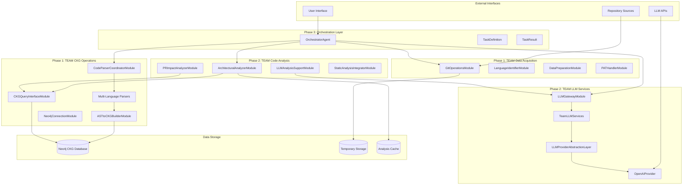
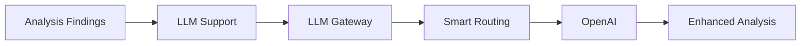
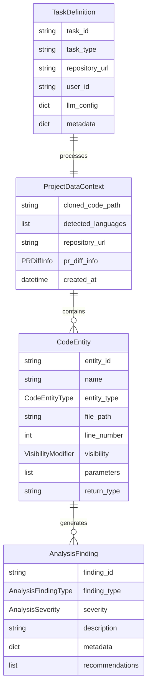
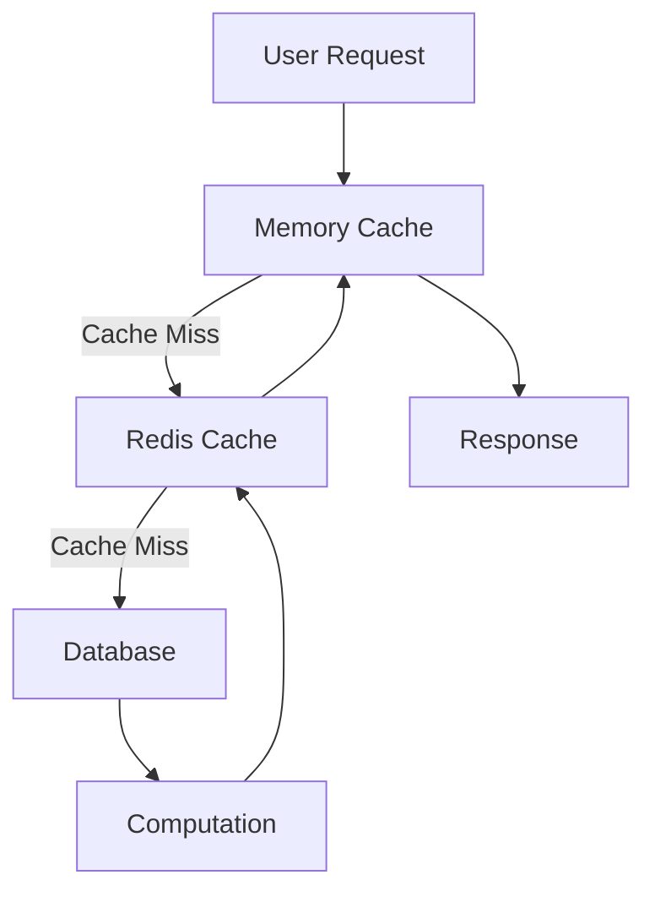
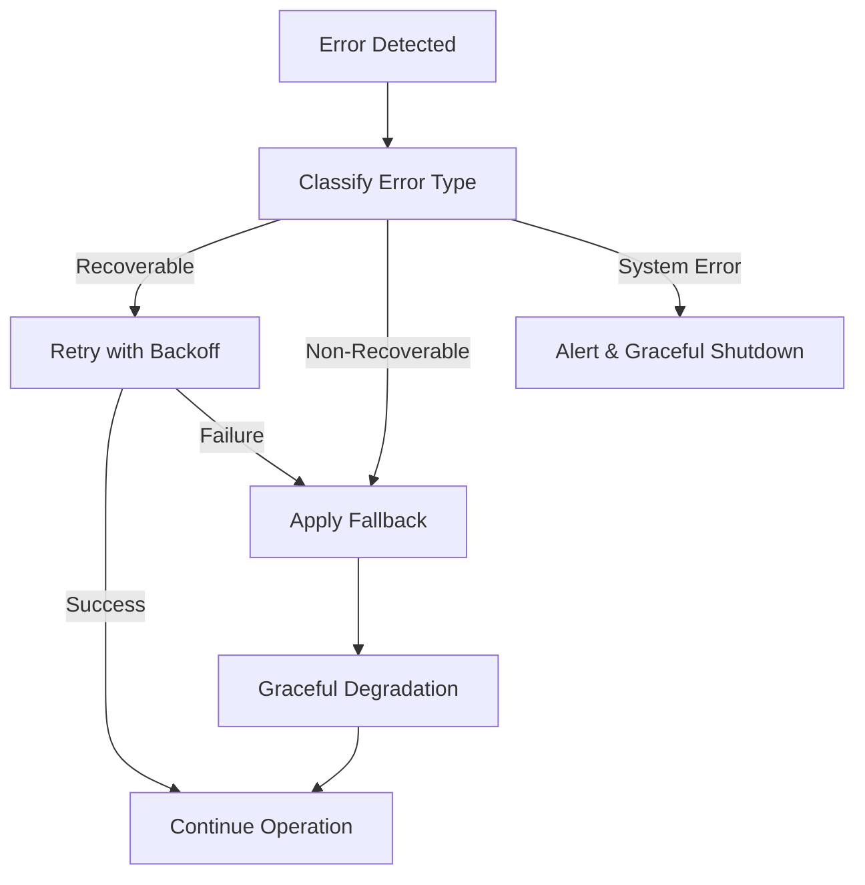
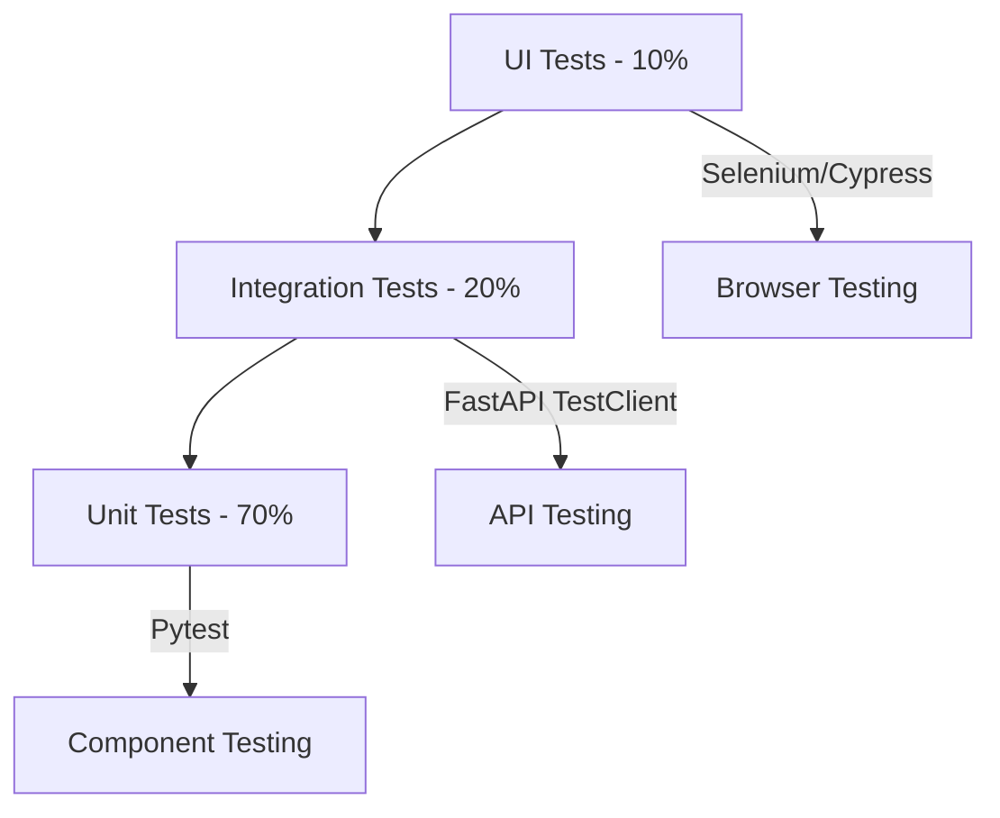

# RepoChat Architecture Overview - Phase 1-3

## Executive Summary

RepoChat là một hệ thống phân tích code repository thông minh sử dụng Code Knowledge Graph (CKG) và Large Language Models (LLM) để cung cấp insights sâu sắc về codebase. Hệ thống được thiết kế theo kiến trúc microservices với 4 TEAM components chính được phối hợp bởi OrchestratorAgent.

## System Vision và Goals

### Vision Statement
"Tạo ra hệ thống phân tích code repository tiên tiến nhất, có khả năng hiểu sâu sắc về kiến trúc code, phát hiện các vấn đề tiềm ẩn và cung cấp recommendations thông minh cho developers."

### Core Goals
1. **Intelligent Analysis**: Phân tích deep semantic của code thông qua CKG và LLM
2. **Multi-language Support**: Hỗ trợ Java, Python, Kotlin, Dart và mở rộng cho nhiều ngôn ngữ khác
3. **Scalable Architecture**: Thiết kế microservices cho khả năng scale horizontal
4. **Real-time Insights**: Cung cấp analysis real-time cho PR reviews và code changes
5. **Production Ready**: Robust error handling, monitoring, và performance optimization

## High-Level Architecture



## Phase-by-Phase Architecture

### Phase 1: Data Acquisition & CKG Operations

#### Purpose
Thiết lập foundation cho data processing và knowledge graph construction.

#### Key Components

**TEAM Data Acquisition**
- **GitOperationsModule**: Repository cloning, branch management, diff extraction
- **LanguageIdentifierModule**: Multi-language detection với confidence scoring
- **DataPreparationModule**: Data validation và preparation
- **PATHandlerModule**: Personal Access Token management (placeholder)

**TEAM CKG Operations**
- **CodeParserCoordinatorModule**: Orchestrates multi-language parsing
- **Language Parsers**: Java (AST), Python (AST), Kotlin (Regex), Dart (Regex)
- **ASTtoCKGBuilderModule**: Transforms code entities thành Neo4j graph
- **CKGQueryInterfaceModule**: Query interface cho knowledge graph
- **Neo4jConnectionModule**: Database connection management

#### Data Flow
```
Repository URL → Git Clone → Language Detection → Code Parsing → CKG Construction
```

#### Key Innovations
1. **Parallel Multi-language Parsing**: Concurrent processing of different languages
2. **Unified Code Entity Model**: Standardized representation across languages
3. **Incremental CKG Building**: Efficient graph construction với batch operations

### Phase 2: Code Analysis & LLM Services

#### Purpose
Thực hiện advanced analysis và integrate LLM capabilities.

#### Key Components

**TEAM Code Analysis**
- **ArchitecturalAnalyzerModule**: Phát hiện patterns, circular dependencies, architectural smells
- **PRImpactAnalyzerModule**: Analyze impact của PR changes
- **LLMAnalysisSupportModule**: Prepare và enhance analysis với LLM
- **StaticAnalysisIntegratorModule**: Placeholder cho static analysis tools

**TEAM LLM Services**
- **LLMGatewayModule**: Central routing và rate limiting
- **TeamLLMServices**: Service orchestration và response handling
- **LLMProviderAbstractionLayer**: Provider-agnostic interface
- **OpenAIProvider**: OpenAI API implementation

#### Analysis Capabilities
1. **Architectural Analysis**: Circular dependency detection, pattern recognition
2. **PR Impact Analysis**: Change impact assessment, risk evaluation
3. **LLM Enhancement**: Code explanation, recommendation generation
4. **Static Analysis Integration**: Linting, formatting, security analysis (placeholder)

#### LLM Integration Strategy


### Phase 3: Orchestrator Integration

#### Purpose
Unified task execution và component coordination.

#### Key Components
- **OrchestratorAgent**: Central coordinator cho all operations
- **TaskDefinition**: Standardized task specifications
- **Integration Points**: Clean interfaces với all TEAM components

#### Orchestration Patterns
1. **Sequential Execution**: Phase 1 → Phase 2 → Results
2. **Parallel Processing**: Multi-language parsing, concurrent analysis
3. **Error Recovery**: Graceful degradation, retry mechanisms
4. **Resource Management**: Memory optimization, cleanup procedures

## Technology Stack

### Core Technologies
- **Language**: Python 3.8+
- **Frameworks**: FastAPI, Pydantic, SQLAlchemy
- **Database**: Neo4j (Graph), SQLite (Temporary)
- **Testing**: Pytest, unittest
- **Documentation**: Mermaid, Markdown

### External Services
- **Version Control**: Git, GitHub API
- **LLM Providers**: OpenAI GPT-4, Ollama (Llama2, CodeLlama, Mistral), Google GenAI
- **Code Analysis**: AST parsing, Regex patterns
- **Monitoring**: Performance metrics, Error tracking

### Development Tools
- **Code Quality**: Black formatter, Flake8 linter
- **Dependency Management**: Requirements.txt, Virtual environments
- **Version Control**: Git với semantic versioning
- **Testing**: Automated test suites với CI/CD ready

## Data Architecture

### Data Models



### Data Flow Patterns

#### 1. Repository Processing Flow
```
User Input → Task Definition → Repository Acquisition → Language Detection → Code Parsing → CKG Construction → Analysis → Results
```

#### 2. PR Review Flow
```
PR Information → Diff Extraction → Impact Analysis → LLM Enhancement → Review Results
```

#### 3. LLM Enhancement Flow
```
Analysis Findings → Context Preparation → LLM Request → Response Processing → Enhanced Results
```

## Security Architecture

### Security Principles
1. **Defense in Depth**: Multiple security layers
2. **Principle of Least Privilege**: Minimal required permissions
3. **Secure by Default**: Security-first configuration
4. **Data Protection**: Encryption và secure storage

### Security Measures

#### Authentication & Authorization
- **API Key Management**: Secure storage và rotation
- **Access Control**: Role-based permissions
- **Token Validation**: JWT-based authentication
- **Audit Logging**: Comprehensive access logs

#### Data Security
- **Encryption at Rest**: Database encryption
- **Encryption in Transit**: TLS/SSL communications
- **Data Sanitization**: Input validation và cleaning
- **PII Protection**: Personal information anonymization

#### Infrastructure Security
- **Network Security**: VPC, firewalls, security groups
- **Container Security**: Secure base images, vulnerability scanning
- **Dependency Security**: Regular security updates
- **Monitoring**: Real-time security event detection

## Performance Architecture

### Performance Goals
- **Response Time**: < 2s for typical analysis
- **Throughput**: 100+ concurrent requests
- **Scalability**: Horizontal scaling capabilities
- **Availability**: 99.9% uptime target

### Optimization Strategies

#### Caching Strategy


#### Performance Optimizations
1. **Parallel Processing**: Multi-threading for parsing operations
2. **Batch Operations**: Bulk database insertions
3. **Connection Pooling**: Reuse database connections
4. **Lazy Loading**: On-demand data loading
5. **Result Caching**: Cache analysis results
6. **Memory Management**: Efficient memory usage patterns

### Monitoring & Observability

#### Metrics Collection
- **Performance Metrics**: Response times, throughput, error rates
- **Resource Metrics**: CPU, memory, disk usage
- **Business Metrics**: Analysis accuracy, user satisfaction
- **Custom Metrics**: Component-specific measurements

#### Logging Strategy
```python
# Example logging structure
{
    "timestamp": "2024-12-28T10:00:00Z",
    "level": "INFO",
    "component": "GitOperationsModule",
    "operation": "clone_repository",
    "repository_url": "github.com/user/repo",
    "duration_ms": 1500,
    "status": "success",
    "metadata": {
        "files_processed": 150,
        "languages_detected": ["java", "python"]
    }
}
```

## Error Handling & Resilience

### Error Handling Strategy

#### Error Classification
1. **Recoverable Errors**: Network timeouts, temporary service unavailability
2. **Non-Recoverable Errors**: Invalid input, authentication failures
3. **System Errors**: Out of memory, database connection failures
4. **Business Logic Errors**: Analysis failures, validation errors

#### Recovery Mechanisms


### Resilience Patterns

#### Circuit Breaker Pattern
- **Closed State**: Normal operation
- **Open State**: Fast failure during outages
- **Half-Open State**: Testing recovery

#### Retry Pattern
- **Exponential Backoff**: Increasing delays between retries
- **Maximum Retry Limits**: Prevent infinite loops
- **Jitter**: Random delay variation

#### Bulkhead Pattern
- **Resource Isolation**: Separate resource pools
- **Failure Containment**: Prevent cascade failures

## Extensibility & Future Roadmap

### Extensibility Points

#### 1. Language Support Extension
```python
# Adding new language parser
class NewLanguageParser(BaseParser):
    def parse_files(self, files: List[str]) -> List[CodeEntity]:
        # Implementation for new language
        pass
```

#### 2. Analysis Module Extension
```python
# Adding new analysis capability
class CustomAnalyzerModule:
    def analyze(self, context: ProjectDataContext) -> AnalysisResult:
        # Custom analysis logic
        pass
```

#### 3. LLM Provider Extension
```python
# Adding new LLM provider
class NewLLMProvider(BaseLLMProvider):
    def call_api(self, request: LLMRequest) -> LLMResponse:
        # Provider-specific implementation
        pass
```

### Phase 4-6 Roadmap

#### Phase 4: CLI Development
- **Command Line Interface**: User-friendly CLI tools
- **Configuration Management**: Flexible configuration system
- **Report Generation**: Rich output formats
- **Integration Scripts**: CI/CD integration

#### Phase 5: Web Interface
- **React Frontend**: Modern web interface
- **Real-time Updates**: WebSocket connections
- **Interactive Visualizations**: Code graphs, metrics dashboards
- **User Management**: Authentication, user profiles

#### Phase 6: Advanced Features
- **Machine Learning**: Pattern learning, anomaly detection
- **Advanced Analytics**: Trend analysis, prediction
- **Enterprise Features**: SSO, RBAC, audit trails
- **API Ecosystem**: Public APIs, webhooks, integrations

## Quality Assurance

### Testing Strategy

#### Test Pyramid


#### Test Categories
1. **Unit Tests**: Individual component testing
2. **Integration Tests**: Component interaction testing
3. **End-to-End Tests**: Complete workflow testing
4. **Performance Tests**: Load và stress testing
5. **Security Tests**: Vulnerability assessment

### Code Quality Standards

#### Code Quality Metrics
- **Test Coverage**: > 90% coverage target
- **Code Complexity**: Cyclomatic complexity < 10
- **Duplication**: < 3% code duplication
- **Technical Debt**: Continuous monitoring và reduction

#### Quality Gates
1. **Pre-commit Hooks**: Code formatting, linting
2. **Pull Request Reviews**: Peer code review
3. **Automated Testing**: CI pipeline validation
4. **Security Scanning**: Dependency vulnerability checks

## Deployment Architecture

### Container Strategy
```dockerfile
# Multi-stage build example
FROM python:3.8-slim as builder
COPY requirements.txt .
RUN pip install --user -r requirements.txt

FROM python:3.8-slim
COPY --from=builder /root/.local /root/.local
COPY . /app
WORKDIR /app
CMD ["python", "main.py"]
```

### Infrastructure as Code
- **Docker Containers**: Consistent environments
- **Kubernetes Orchestration**: Scalable deployment
- **Terraform Configuration**: Infrastructure provisioning
- **CI/CD Pipelines**: Automated deployment

## Conclusion

RepoChat Phase 1-3 architecture tạo ra foundation vững chắc cho một intelligent code analysis system. Với:

✅ **Modular Design**: Clear separation of concerns  
✅ **Scalable Architecture**: Horizontal scaling capabilities  
✅ **Robust Error Handling**: Comprehensive resilience patterns  
✅ **Extensible Framework**: Easy addition of new capabilities  
✅ **Production Ready**: Security, monitoring, performance optimization  

Hệ thống sẵn sàng cho Phase 4 CLI development và future enhancements. Architecture được thiết kế để handle enterprise-scale workloads với high availability và security requirements.

---

**Document Version:** 1.0  
**Last Updated:** 2024-12-28  
**Phase Coverage:** 1-3 Complete  
**Status:** Production Ready Architecture  
**Next Phase:** CLI Development (Phase 4) 