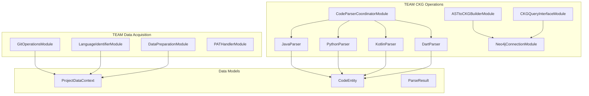
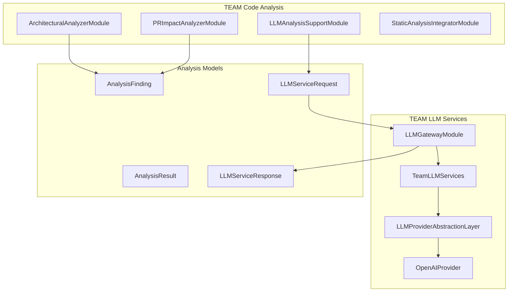
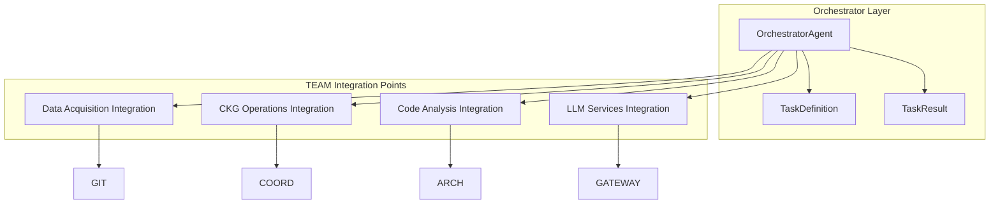
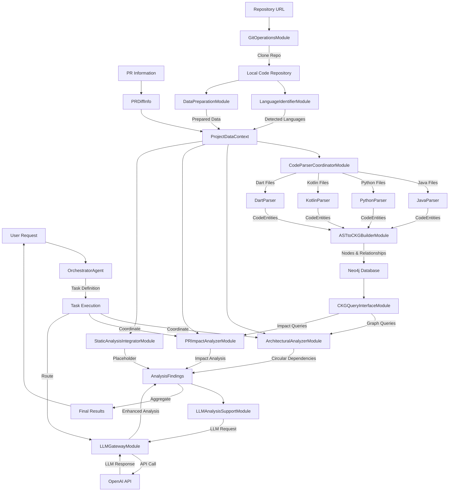
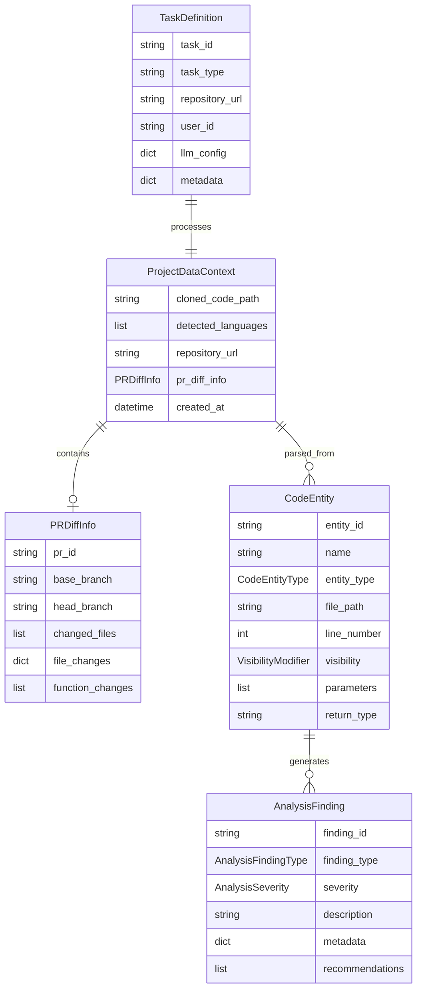
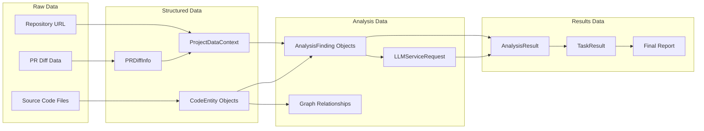
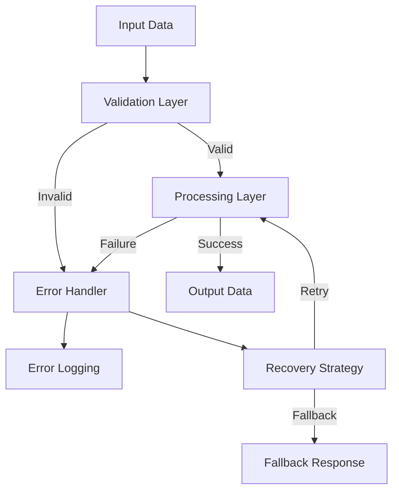

# RepoChat Data Flow Architecture - Phase 1-3

## Overview

This document describes the complete data flow architecture for RepoChat system from Phase 1 through Phase 3, covering:

- **Phase 1**: Data Acquisition & CKG Operations
- **Phase 2**: Code Analysis & LLM Services  
- **Phase 3**: Orchestrator Integration & PR Impact Analysis

## System Architecture Components

### Phase 1: Data Acquisition & CKG Operations



### Phase 2: Code Analysis & LLM Services



### Phase 3: Orchestrator Integration



## Complete Data Flow Diagram



## Data Flow Descriptions

### 1. Repository Acquisition Flow

```
User Request → OrchestratorAgent → GitOperationsModule → Local Repository
```

**Data Types:**
- Input: Repository URL, Authentication tokens
- Processing: Git clone operations, repository validation
- Output: ProjectDataContext with cloned code path

### 2. Language Detection Flow

```
Local Repository → LanguageIdentifierModule → ProjectDataContext
```

**Data Types:**
- Input: File system paths, file extensions, content analysis
- Processing: Language detection algorithms, confidence scoring
- Output: Detected languages list with confidence scores

### 3. Code Parsing Flow

```
ProjectDataContext → CodeParserCoordinatorModule → Language Parsers → CodeEntities
```

**Data Types:**
- Input: Source code files by language
- Processing: AST parsing, entity extraction, relationship identification
- Output: Structured CodeEntity objects with metadata

### 4. CKG Construction Flow

```
CodeEntities → ASTtoCKGBuilderModule → Neo4j Database
```

**Data Types:**
- Input: CodeEntity objects with relationships
- Processing: Graph node creation, relationship mapping, schema validation
- Output: Neo4j graph database with code knowledge graph

### 5. Architectural Analysis Flow

```
ProjectDataContext + CKG → ArchitecturalAnalyzerModule → AnalysisFindings
```

**Data Types:**
- Input: Project structure, dependency information, CKG queries
- Processing: Pattern detection, circular dependency analysis, architectural smells
- Output: AnalysisFinding objects with severity levels

### 6. PR Impact Analysis Flow

```
ProjectDataContext + PRDiffInfo → PRImpactAnalyzerModule → Impact AnalysisFindings
```

**Data Types:**
- Input: PR diff information, changed files, function modifications
- Processing: Impact scope analysis, caller/callee identification, risk assessment
- Output: Impact-specific AnalysisFinding objects

### 7. LLM Enhancement Flow

```
AnalysisFindings → LLMAnalysisSupportModule → LLMGatewayModule → Enhanced Analysis
```

**Data Types:**
- Input: Raw analysis findings, code snippets, context information
- Processing: Prompt engineering, API requests, response parsing
- Output: LLM-enhanced analysis with explanations and recommendations

### 8. Orchestration Coordination Flow

```
TaskDefinition → OrchestratorAgent → TEAM Coordination → TaskResult
```

**Data Types:**
- Input: Task specifications, user preferences, configuration
- Processing: Component coordination, data flow management, error handling
- Output: Aggregated results with execution metadata

## Data Models and Relationships

### Core Data Models



### Data Transformation Pipeline



## Performance Considerations

### Data Volume Handling

1. **Large Repository Processing**
   - Incremental parsing for large codebases
   - Parallel processing for multi-language projects
   - Memory-efficient streaming for file processing

2. **CKG Scalability**
   - Batch operations for Neo4j insertions
   - Index optimization for common queries
   - Connection pooling for concurrent access

3. **LLM Request Optimization**
   - Request batching and rate limiting
   - Context size optimization
   - Response caching for similar queries

### Data Persistence Strategy

1. **Temporary Data**
   - ProjectDataContext: In-memory during task execution
   - Cloned repositories: Temporary storage with cleanup

2. **Persistent Data**
   - Neo4j CKG: Long-term storage for reusability
   - Analysis cache: Configurable retention period

3. **Streaming Data**
   - Real-time log streams for monitoring
   - Progressive result delivery for large analyses

## Error Handling and Data Integrity

### Data Validation



### Data Flow Monitoring

1. **Performance Metrics**
   - Processing time per component
   - Memory usage tracking
   - API call latency monitoring

2. **Data Quality Metrics**
   - Parse success rates
   - Analysis finding accuracy
   - LLM response quality scores

3. **System Health Indicators**
   - Component availability status
   - Resource utilization levels
   - Error rate thresholds

## Future Enhancements

### Phase 4+ Considerations

1. **Real-time Data Streaming**
   - Live repository monitoring
   - Incremental analysis updates
   - WebSocket-based result delivery

2. **Advanced Caching Strategies**
   - Multi-level caching hierarchy
   - Intelligent cache invalidation
   - Cross-repository analysis caching

3. **Data Pipeline Optimization**
   - Machine learning-based optimization
   - Adaptive processing strategies
   - Predictive resource allocation

---

**Document Version:** 1.0  
**Last Updated:** 2024-12-28  
**Phase Coverage:** 1-3 Complete  
**Status:** Production Ready 