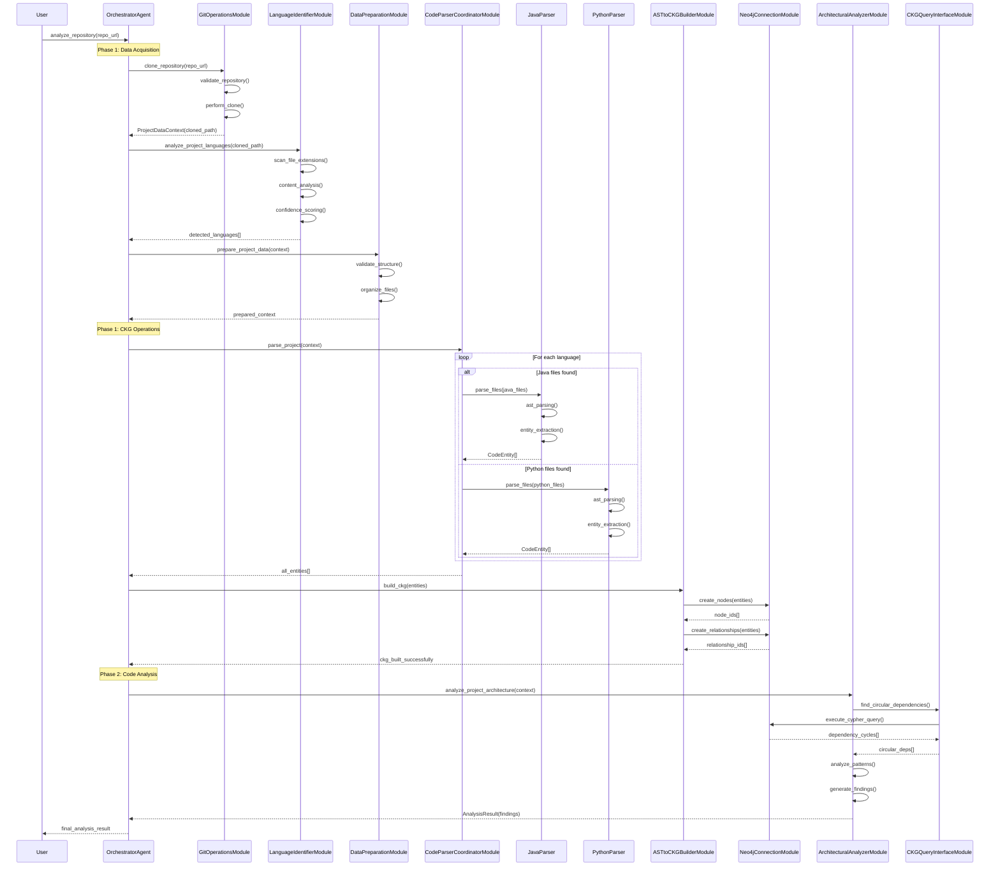
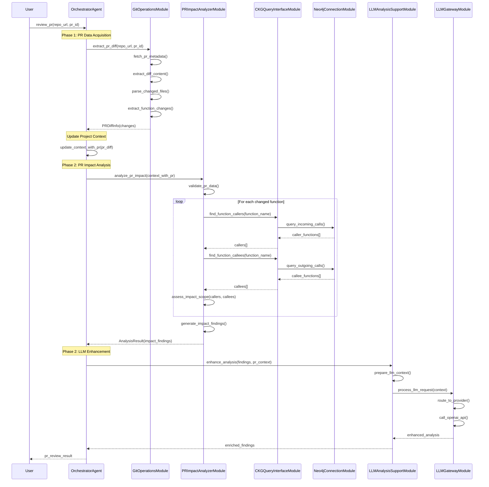
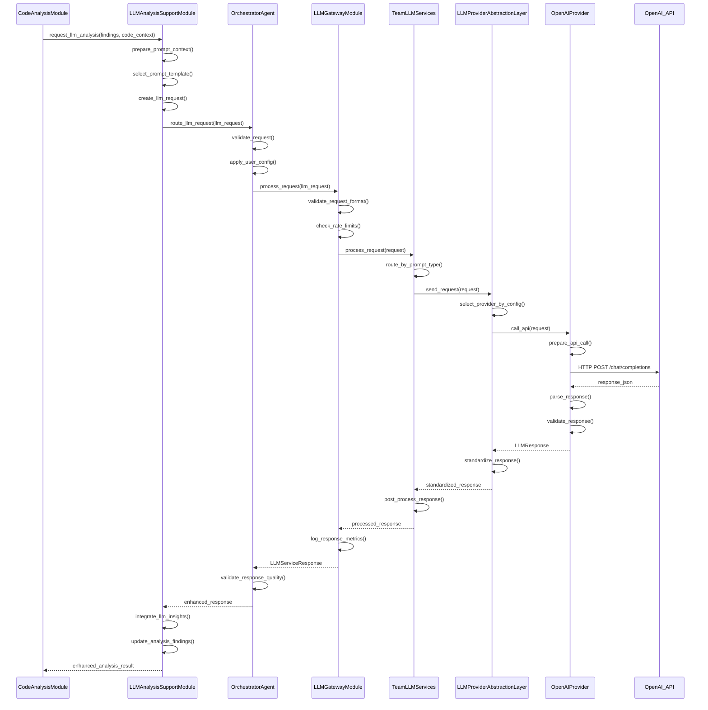
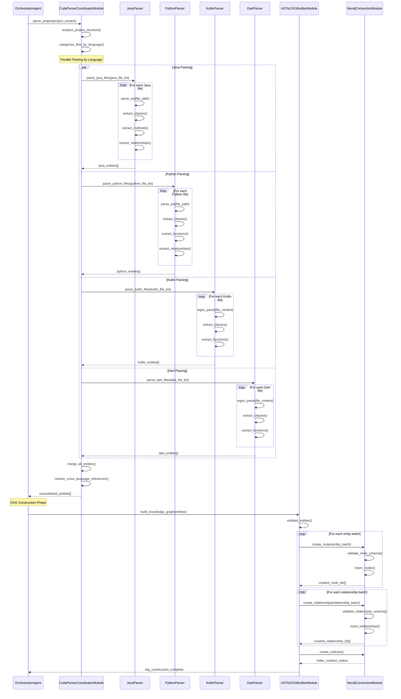
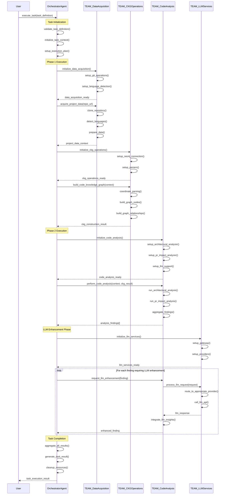
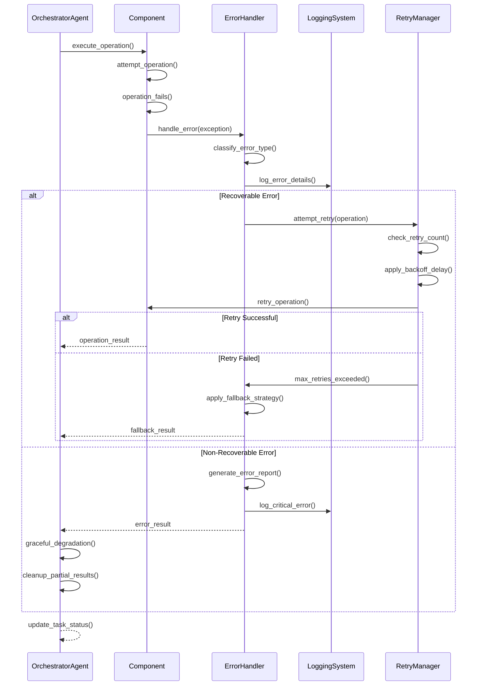
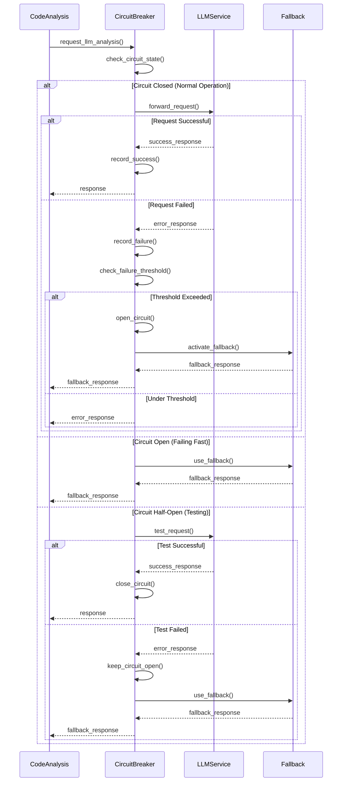
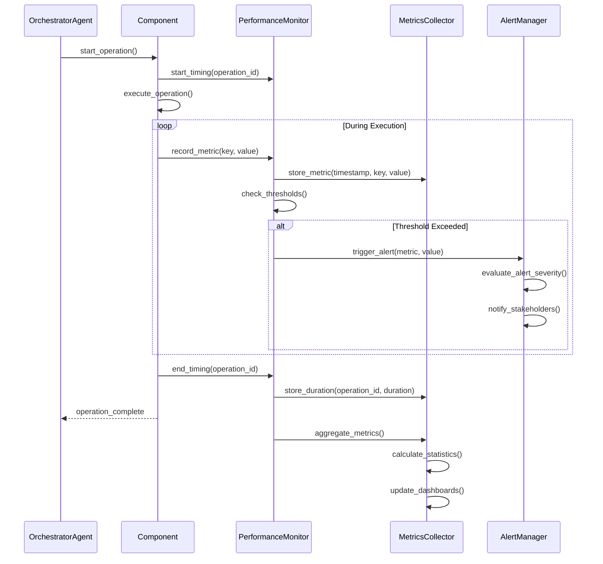

# RepoChat Sequence Diagrams - Phase 1-3

## Overview

This document provides detailed sequence diagrams for all major workflows in RepoChat system from Phase 1 through Phase 3. Each diagram shows the temporal flow of interactions between components.

## Table of Contents

1. [Repository Analysis Workflow](#repository-analysis-workflow)
2. [PR Review Workflow](#pr-review-workflow)
3. [LLM Enhancement Workflow](#llm-enhancement-workflow)
4. [Code Parsing and CKG Construction](#code-parsing-and-ckg-construction)
5. [Orchestrator Task Execution](#orchestrator-task-execution)
6. [Error Handling Flows](#error-handling-flows)

---

## Repository Analysis Workflow

### Complete Repository Analysis Sequence

---

## PR Review Workflow

### PR Impact Analysis Sequence

---

## LLM Enhancement Workflow

### LLM Request Processing Sequence

---

## Code Parsing and CKG Construction

### Multi-Language Parsing Sequence

---

## Orchestrator Task Execution

### Complete Task Orchestration Sequence

---

## Error Handling Flows

### Error Recovery Sequence

### Circuit Breaker Pattern for LLM Services

---

## Performance Monitoring Sequence

### Real-time Performance Tracking

---

## Summary

These sequence diagrams provide a comprehensive view of:

1. **Data Flow Orchestration**: How data moves through the system components
2. **Error Handling**: Robust error recovery and fallback mechanisms
3. **Performance Monitoring**: Real-time system health tracking
4. **LLM Integration**: Complex request routing and response handling
5. **Multi-language Processing**: Parallel parsing coordination
6. **PR Analysis**: Detailed impact assessment workflows

Each diagram represents production-ready patterns that ensure:
- **Reliability**: Comprehensive error handling and recovery
- **Scalability**: Parallel processing and efficient resource utilization
- **Maintainability**: Clear component boundaries and responsibilities
- **Observability**: Extensive logging and monitoring throughout

---

**Document Version:** 1.0  
**Last Updated:** 2024-12-28  
**Phase Coverage:** 1-3 Complete  
**Status:** Production Ready 